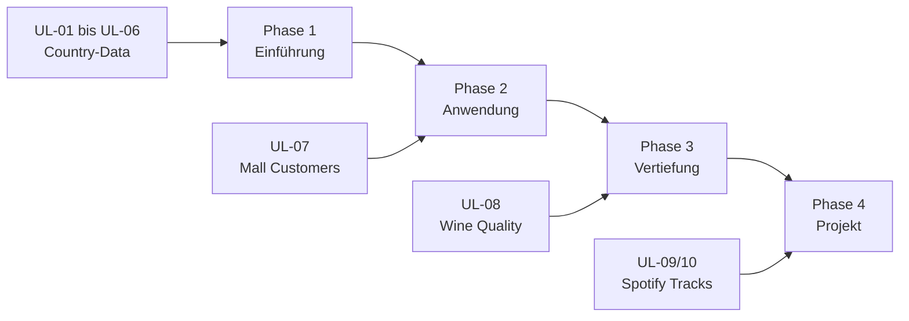

# Unsupervised Learning

Willkommen zur Lernsituation **Unsupervised Learning**!

Diese Lernmaterialien richten sich an angehende **Fachinformatiker/innen für Daten- und Prozessanalyse** und vermitteln die grundlegenden Techniken des maschinellen Lernens ohne Labels.

---

## 🗺️ Dein Lernpfad



---

## 📚 Struktur der Materialien

### Infoblätter (Nachschlagewerke)

Die Infoblätter dienen als **Referenz** und erklären Konzepte und Syntax.

| Nr. | Infoblatt | Thema |
|-----|-----------|-------|
| I-01 | [Einführung Unsupervised Learning](infoblaetter/einfuehrung-unsupervised.md) | Supervised vs. Unsupervised, Anwendungsfälle |
| I-02 | [Datenvorverarbeitung](infoblaetter/datenvorverarbeitung.md) | Skalierung, Feature Selection |
| I-03 | [K-Means Clustering](infoblaetter/kmeans-clustering.md) | Algorithmus, Elbow-Methode, Silhouette |
| I-04 | [Hierarchisches Clustering](infoblaetter/hierarchisches-clustering.md) | Dendrogramme, Linkage-Methoden |
| I-05 | [PCA (Dimensionsreduktion)](infoblaetter/pca-dimensionsreduktion.md) | Hauptkomponentenanalyse, Varianz |
| I-06 | [Weitere Algorithmen](infoblaetter/weitere-algorithmen.md) | DBSCAN, GMM, Vergleich |
| I-07 | [Cluster-Evaluation](infoblaetter/cluster-evaluation.md) | Metriken, Interpretation |
| I-08 | [Große Datenmengen](infoblaetter/grosse-datenmengen.md) | Sampling, Mini-Batch K-Means |

---

### Arbeitsblätter (Übungen)

Die Arbeitsblätter enthalten **praktische Aufgaben** mit steigendem Schwierigkeitsgrad.

=== "Phase 1: Einführung"
    | Nr. | Arbeitsblatt | Thema | Datensatz | Level |
    |-----|-------------|-------|-----------|-------|
    | UL-01 | [Einführung](arbeitsblaetter/ul-01-einfuehrung.md) | Was ist Clustering? | Country-data | ⭐ |
    | UL-02 | [Vorverarbeitung](arbeitsblaetter/ul-02-vorverarbeitung.md) | Skalierung, Exploration | Country-data | ⭐ |
    | UL-03 | [K-Means](arbeitsblaetter/ul-03-kmeans.md) | Algorithmus, Elbow | Iris + Country | ⭐⭐ |
    | UL-04 | [PCA](arbeitsblaetter/ul-04-pca.md) | Dimensionsreduktion | Iris | ⭐⭐ |
    | UL-05 | [Interpretation](arbeitsblaetter/ul-05-interpretation.md) | Cluster-Profile | Country-data | ⭐⭐ |
    | UL-06 | [Hierarchisch](arbeitsblaetter/ul-06-hierarchisch.md) | Dendrogramme | Country-data | ⭐⭐ |

=== "Phase 2-4: Anwendung & Projekt"
    | Nr. | Arbeitsblatt | Thema | Datensatz | Level |
    |-----|-------------|-------|-----------|-------|
    | UL-07 | [Kundensegmentierung](arbeitsblaetter/ul-07-kundensegmentierung.md) | Eigenständige Analyse | Mall Customers | ⭐⭐⭐ |
    | UL-08 | [Weinqualität](arbeitsblaetter/ul-08-weinqualitaet.md) | Algorithmenvergleich | Wine Quality | ⭐⭐⭐ |
    | UL-09 | [Musik-Clustering](arbeitsblaetter/ul-09-musik-clustering.md) | Projektvorbereitung | Spotify Tracks | ⭐⭐⭐⭐ |
    | UL-10 | [Abschlussprojekt](arbeitsblaetter/ul-10-abschlussprojekt.md) | Vollständige Analyse | Spotify Tracks | ⭐⭐⭐⭐⭐ |

=== "Optional"
    | Nr. | Arbeitsblatt | Thema | Datensatz | Level |
    |-----|-------------|-------|-----------|-------|
    | UL-OPT-01 | [Kreditkarten](arbeitsblaetter/ul-opt-01-kreditkarten.md) | DBSCAN, GMM | CustomerData | ⭐⭐⭐⭐ |
    | UL-OPT-02 | [Big Data](arbeitsblaetter/ul-opt-02-big-data.md) | Große Datenmengen | US-Accidents | ⭐⭐⭐⭐⭐ |

---

## 🎯 Lernziele

Nach Bearbeitung der Materialien kannst du:

!!! success "Wissen"
    - [x] Den Unterschied zwischen Supervised und Unsupervised Learning erklären
    - [x] Die Funktionsweise von K-Means, Hierarchischem Clustering und DBSCAN beschreiben
    - [x] PCA als Dimensionsreduktionsmethode erklären
    - [x] Metriken zur Cluster-Evaluation benennen und interpretieren

!!! success "Können"
    - [x] Daten für Clustering vorbereiten (Skalierung, Feature Selection)
    - [x] Die optimale Clusteranzahl bestimmen (Elbow, Silhouette)
    - [x] Verschiedene Clustering-Algorithmen mit scikit-learn anwenden
    - [x] Cluster-Ergebnisse visualisieren und interpretieren

!!! success "Bewerten"
    - [x] Algorithmen für verschiedene Anwendungsfälle auswählen
    - [x] Clustering-Ergebnisse kritisch bewerten
    - [x] Geschäftliche Empfehlungen aus Analysen ableiten

---

## 📁 Datensätze

| Datensatz | Beschreibung | Umfang | Verwendet in |
|-----------|--------------|--------|--------------|
| `Country-data.csv` | Länderdaten (Wirtschaft, Gesundheit) | 167 Länder, 9 Features | UL-01 bis UL-06 |
| `Mall_Customers.csv` | Kundensegmentierung | 200 Kunden, 5 Features | UL-07 |
| Wine Quality | Weinqualität (rot/weiß) | ~6.500 Zeilen, 11 Features | UL-08 |
| Spotify Tracks | Audio-Features von Songs | ~100k Tracks | UL-09, UL-10 |
| `CustomerData.csv` | Kreditkartennutzung | ~900 Kunden, 17 Features | UL-OPT-01 |
| US-Accidents | Verkehrsunfälle USA | 7,7 Mio. Datensätze | UL-OPT-02 |

!!! info "Iris-Dataset"
    Das Iris-Dataset ist in scikit-learn integriert und wird mit `load_iris()` geladen.

---

## ⏱️ Zeitplanung

| Phase | Arbeitsblätter | Zeitaufwand |
|-------|---------------|-------------|
| **Phase 1: Einführung** | UL-01 bis UL-06 | 6-8 Stunden |
| **Phase 2: Anwendung** | UL-07 | 2-3 Stunden |
| **Phase 3: Vertiefung** | UL-08 | 2-3 Stunden |
| **Phase 4: Projekt** | UL-09, UL-10 | 4-6 Stunden |
| **Gesamt** | | **14-20 Stunden** |

---

## 🔧 Voraussetzungen

Für die Bearbeitung benötigst du:

- [ ] Python 3.8 oder höher
- [ ] NumPy, Pandas, Matplotlib, Seaborn
- [ ] scikit-learn, scipy
- [ ] Jupyter Notebook (IBM Server oder lokal)

```python
# Installation prüfen
import numpy as np
import pandas as pd
import matplotlib.pyplot as plt
import seaborn as sns
from sklearn.cluster import KMeans
from sklearn.preprocessing import StandardScaler
from sklearn.decomposition import PCA

print("Alle Bibliotheken erfolgreich importiert! ✓")
```

---

## 💡 Tipps für erfolgreiches Lernen

!!! info "So arbeitest du mit den Materialien"
    **Dokumentation im Jupyter Notebook:**
    
    - Beantworte alle Fragen in **Markdown-Zellen** direkt im Notebook
    - Füge nach jedem Code-Block eine neue Markdown-Zelle für deine Antworten ein
    - Dokumentiere auch Beobachtungen und Experimente
    - So entsteht automatisch eine vollständige Dokumentation deiner Arbeit
    
    ```markdown
    ## Meine Antwort zu Aufgabe 2
    
    a) Die Spanne von income ist etwa **500x größer** als die von child_mort...
    
    b) Das Feature income dominiert, weil...
    ```

!!! tip "Praktische Tipps"
    1. **Infoblätter parallel nutzen** – Sie erklären die Theorie zu jedem Arbeitsblatt
    2. **Visualisieren, visualisieren, visualisieren** – Clustering lebt von Grafiken
    3. **Fehlerbox beachten** – Jedes AB hat typische Fehler mit Lösungen
    4. **Interpretieren üben** – Cluster finden ist einfach, verstehen ist schwer
    5. **Reflexionsfragen beantworten** – Sie vertiefen das Verständnis

!!! warning "Häufiger Anfängerfehler"
    Daten nicht skalieren! Clustering-Algorithmen messen Abstände – ohne Skalierung dominieren Features mit großen Werten.

---

Viel Erfolg bei der Bearbeitung! 🎓
