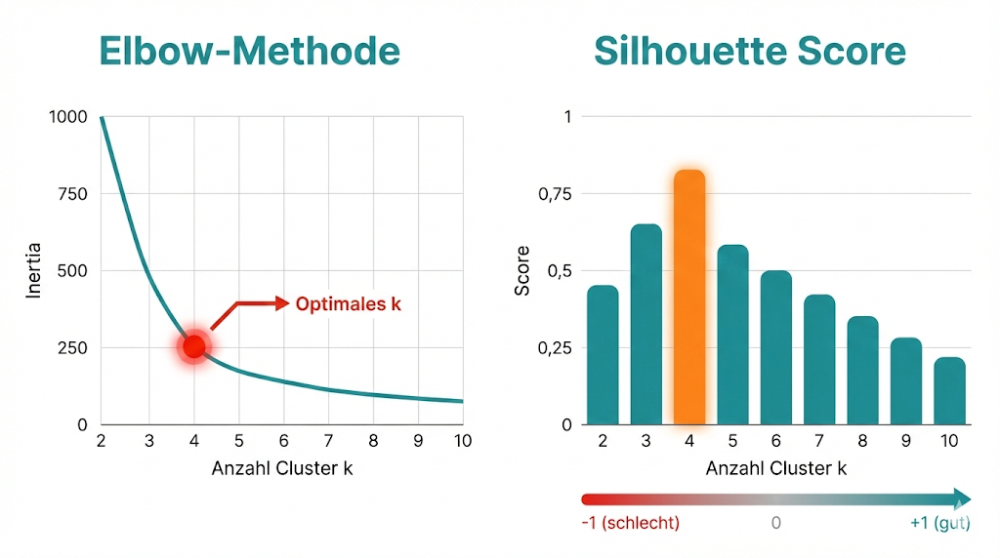

# Cluster-Evaluation & Interpretation

## Das Evaluationsproblem

Bei Unsupervised Learning gibt es keine "richtigen" Labels. Wie bewertet man also, ob das Clustering gut ist?



**Zwei Ansätze:**
1. **Interne Metriken:** Basieren nur auf den Daten
2. **Externe Metriken:** Vergleichen mit bekannten Labels (wenn vorhanden)

---

## Interne Metriken

### Silhouette Score

Misst, wie gut Punkte zu ihrem Cluster passen vs. zu anderen Clustern.

$$s(i) = \frac{b(i) - a(i)}{\max(a(i), b(i))}$$

- **a(i):** Mittlere Distanz zu Punkten im eigenen Cluster
- **b(i):** Mittlere Distanz zum nächsten fremden Cluster

```python
from sklearn.metrics import silhouette_score, silhouette_samples

# Gesamt-Score
score = silhouette_score(X_scaled, labels)
print(f"Silhouette Score: {score:.3f}")

# Score pro Datenpunkt
sample_scores = silhouette_samples(X_scaled, labels)
```

| Wert | Interpretation |
|------|----------------|
| 0.7 - 1.0 | Starke Cluster-Struktur |
| 0.5 - 0.7 | Vernünftige Struktur |
| 0.25 - 0.5 | Schwache Struktur, möglicherweise überlappend |
| < 0.25 | Keine klare Struktur |

### Silhouette-Plot

```python
import matplotlib.pyplot as plt
import numpy as np

fig, ax = plt.subplots(figsize=(10, 8))

y_lower = 10
for i in range(n_clusters):
    cluster_silhouette = sample_scores[labels == i]
    cluster_silhouette.sort()
    
    y_upper = y_lower + len(cluster_silhouette)
    ax.fill_betweenx(np.arange(y_lower, y_upper),
                      0, cluster_silhouette, alpha=0.7)
    ax.text(-0.05, y_lower + 0.5 * len(cluster_silhouette), str(i))
    y_lower = y_upper + 10

ax.axvline(x=score, color='red', linestyle='--', label=f'Durchschnitt: {score:.2f}')
ax.set_xlabel('Silhouette Score')
ax.set_ylabel('Cluster')
ax.legend()
plt.show()
```

### Davies-Bouldin Index

Misst die Ähnlichkeit zwischen Clustern. **Niedriger ist besser!**

```python
from sklearn.metrics import davies_bouldin_score

db_score = davies_bouldin_score(X_scaled, labels)
print(f"Davies-Bouldin Index: {db_score:.3f}")
```

| Wert | Interpretation |
|------|----------------|
| < 1.0 | Gute Trennung |
| 1.0 - 2.0 | Akzeptabel |
| > 2.0 | Cluster überlappen stark |

### Calinski-Harabasz Index

Verhältnis von Zwischen-Cluster-Streuung zu Innerhalb-Cluster-Streuung. **Höher ist besser!**

```python
from sklearn.metrics import calinski_harabasz_score

ch_score = calinski_harabasz_score(X_scaled, labels)
print(f"Calinski-Harabasz Index: {ch_score:.1f}")
```

---

## Metriken-Vergleich

| Metrik | Richtung | Vorteile | Nachteile |
|--------|----------|----------|-----------|
| Silhouette | Höher = besser | Intuitiv, -1 bis 1 | Langsam bei großen Daten |
| Davies-Bouldin | Niedriger = besser | Schnell | Bevorzugt konvexe Cluster |
| Calinski-Harabasz | Höher = besser | Sehr schnell | Skaliert mit Datenanzahl |

```python
# Alle Metriken für verschiedene k berechnen
from sklearn.cluster import KMeans

results = []
for k in range(2, 10):
    kmeans = KMeans(n_clusters=k, random_state=42)
    labels = kmeans.fit_predict(X_scaled)
    
    results.append({
        'k': k,
        'silhouette': silhouette_score(X_scaled, labels),
        'davies_bouldin': davies_bouldin_score(X_scaled, labels),
        'calinski_harabasz': calinski_harabasz_score(X_scaled, labels),
        'inertia': kmeans.inertia_
    })

df_results = pd.DataFrame(results)
print(df_results)
```

---

## Cluster-Interpretation

### Cluster-Profile erstellen

```python
# Mittelwerte pro Cluster
cluster_profiles = df.groupby('Cluster').mean()
print(cluster_profiles)

# Als Heatmap visualisieren
import seaborn as sns
plt.figure(figsize=(12, 8))
sns.heatmap(cluster_profiles.T, annot=True, cmap='coolwarm', center=0)
plt.title('Cluster-Profile')
plt.show()
```

### Normalisierte Profile

```python
# Für besseren Vergleich: Z-Score pro Feature
from scipy import stats

profiles_normalized = cluster_profiles.apply(stats.zscore, axis=0)
plt.figure(figsize=(12, 8))
sns.heatmap(profiles_normalized.T, annot=True, cmap='RdYlGn', center=0)
plt.title('Cluster-Profile (Z-Score normalisiert)')
plt.show()
```

### Radar-Chart (Spider-Plot)

```python
from math import pi

def radar_chart(df, cluster_col='Cluster'):
    categories = df.drop(cluster_col, axis=1).columns
    N = len(categories)
    
    angles = [n / float(N) * 2 * pi for n in range(N)]
    angles += angles[:1]
    
    fig, ax = plt.subplots(figsize=(10, 10), subplot_kw=dict(polar=True))
    
    for cluster in df[cluster_col].unique():
        values = df[df[cluster_col] == cluster].drop(cluster_col, axis=1).values.flatten().tolist()
        values += values[:1]
        ax.plot(angles, values, 'o-', linewidth=2, label=f'Cluster {cluster}')
        ax.fill(angles, values, alpha=0.25)
    
    ax.set_xticks(angles[:-1])
    ax.set_xticklabels(categories)
    ax.legend(loc='upper right')
    plt.show()
```

---

## Cluster benennen

Nach der Analyse solltest du Clustern aussagekräftige Namen geben:

```python
# Beispiel: Länder-Clustering
cluster_names = {
    0: 'Entwicklungsländer',
    1: 'Schwellenländer',
    2: 'Industrieländer'
}

df['Cluster_Name'] = df['Cluster'].map(cluster_names)
```

!!! tip "Gute Cluster-Namen"
    - Beschreiben die Hauptmerkmale
    - Sind verständlich für Nicht-Techniker
    - Keine Zahlen (Cluster 0, 1, 2) in Berichten verwenden!

---

## Wann Clustering NICHT nutzen

!!! failure "Clustering ist problematisch wenn..."
    
    **1. Keine natürliche Gruppenstruktur**
    ```
    Silhouette Score < 0.25 → Keine klaren Cluster
    ```
    
    **2. Du exakte Vorhersagen brauchst**
    ```
    Clustering = Exploration, nicht Prädiktion
    ```
    
    **3. Du bereits Labels hast**
    ```
    → Supervised Learning nutzen!
    ```
    
    **4. Die Features unkorreliert sind**
    ```
    Random Features → Random Cluster
    ```

### Cluster validieren

```python
# Sind die Cluster "echt"?
def cluster_stability(X, n_runs=10, k=3):
    """Führe Clustering mehrmals aus und vergleiche Ergebnisse."""
    from sklearn.metrics import adjusted_rand_score
    
    results = []
    for _ in range(n_runs):
        labels = KMeans(n_clusters=k).fit_predict(X)
        results.append(labels)
    
    # Paarweise Übereinstimmung
    scores = []
    for i in range(n_runs):
        for j in range(i+1, n_runs):
            scores.append(adjusted_rand_score(results[i], results[j]))
    
    return np.mean(scores)

stability = cluster_stability(X_scaled)
print(f"Cluster-Stabilität: {stability:.2f}")  # > 0.8 ist gut
```

---

## Zusammenfassung

!!! success "Das Wichtigste"
    - **Silhouette Score:** Intuitiv, zwischen -1 und 1, höher ist besser
    - **Davies-Bouldin:** Niedriger ist besser, misst Cluster-Überlappung
    - **Cluster-Profile:** Mittelwerte + Heatmap für Interpretation
    - Metriken allein reichen nicht – **inhaltliche Interpretation ist entscheidend!**

---

??? question "Selbstkontrolle"
    1. Was bedeutet ein Silhouette Score von 0.3?
    2. Wie interpretierst du einen Davies-Bouldin Index von 0.8?
    3. Wie erstellst du ein Cluster-Profil?
    4. Wann solltest du auf Clustering verzichten?
    
    ??? success "Antworten"
        1. Schwache Cluster-Struktur, Cluster überlappen möglicherweise
        2. Gute Trennung der Cluster (< 1.0 ist gut)
        3. Mittelwerte der Features pro Cluster berechnen und z.B. als Heatmap visualisieren
        4. Wenn keine natürliche Gruppenstruktur existiert, Labels vorhanden sind, oder exakte Vorhersagen benötigt werden
