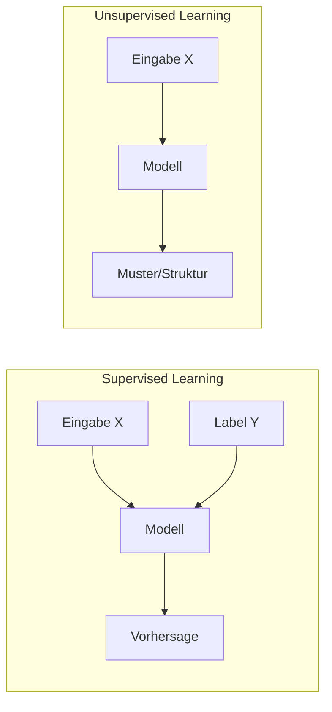
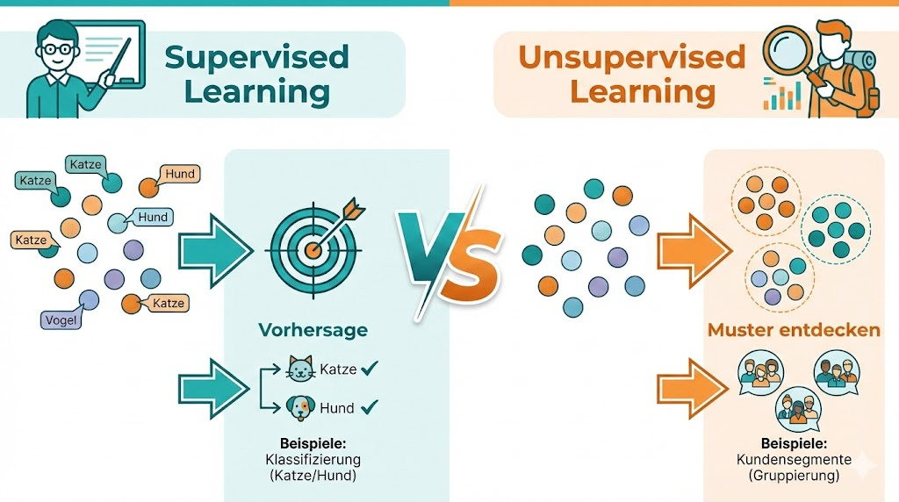
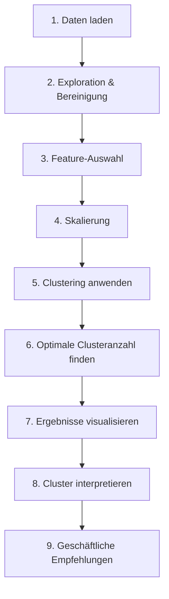

# Einführung Unsupervised Learning

## Was ist Unsupervised Learning?

**Unsupervised Learning** (unüberwachtes Lernen) ist ein Bereich des maschinellen Lernens, bei dem Algorithmen Muster in Daten finden – **ohne vorgegebene Labels oder "richtige Antworten"**.



---

## Supervised vs. Unsupervised



| Aspekt | Supervised Learning | Unsupervised Learning |
|--------|--------------------|-----------------------|
| **Labels** | Ja, Daten sind gelabelt | Nein, keine Labels |
| **Ziel** | Vorhersage | Strukturentdeckung |
| **Beispiele** | Klassifikation, Regression | Clustering, Dimensionsreduktion |
| **Evaluation** | Accuracy, RMSE, etc. | Silhouette, Elbow |
| **Anwendung** | Spam-Filter, Preisvorhersage | Kundensegmentierung, Anomalien |

!!! example "Analogie"
    **Supervised:** Ein Lehrer zeigt dir Bilder von Katzen und Hunden und sagt dir, was was ist. Du lernst, sie zu unterscheiden.
    
    **Unsupervised:** Du bekommst viele Tierbilder ohne Beschriftung und sollst selbst Gruppen finden. Du entdeckst vielleicht: "Diese Tiere haben Fell, diese Federn, diese Schuppen."

---

## Hauptaufgaben im Unsupervised Learning

### 1. Clustering

**Ziel:** Ähnliche Datenpunkte in Gruppen (Cluster) zusammenfassen.

```python
from sklearn.cluster import KMeans

# 3 Cluster finden
kmeans = KMeans(n_clusters=3, random_state=42)
labels = kmeans.fit_predict(X)
```

**Anwendungsfälle:**
- Kundensegmentierung (Marketing)
- Dokumenten-Gruppierung (NLP)
- Bildsegmentierung (Computer Vision)
- Anomalie-Erkennung (Fraud Detection)

### 2. Dimensionsreduktion

**Ziel:** Anzahl der Features reduzieren, ohne wichtige Information zu verlieren.

```python
from sklearn.decomposition import PCA

# Auf 2 Dimensionen reduzieren
pca = PCA(n_components=2)
X_reduced = pca.fit_transform(X)
```

**Anwendungsfälle:**
- Visualisierung hochdimensionaler Daten
- Rauschunterdrückung
- Feature-Engineering
- Beschleunigung anderer Algorithmen

### 3. Assoziationsanalyse

**Ziel:** Regeln und Zusammenhänge in Transaktionsdaten finden.

**Beispiel:** "Kunden, die Windeln kaufen, kaufen oft auch Bier."

---

## Wichtige Algorithmen

| Algorithmus | Typ | Kurzbeschreibung |
|-------------|-----|------------------|
| **K-Means** | Clustering | Teilt in k Cluster basierend auf Zentroiden |
| **Hierarchisches Clustering** | Clustering | Baut Baumstruktur (Dendrogramm) auf |
| **DBSCAN** | Clustering | Dichtebasiert, findet Ausreißer |
| **GMM** | Clustering | Probabilistisch, weiche Zuordnung |
| **PCA** | Dimensionsreduktion | Lineare Projektion auf Hauptkomponenten |
| **t-SNE / UMAP** | Dimensionsreduktion | Nicht-linear, für Visualisierung |

---

## Der typische Workflow



---

## Herausforderungen

!!! warning "Typische Schwierigkeiten"
    1. **Keine "richtige" Lösung** – Anders als bei Supervised Learning gibt es keine Labels zur Validierung
    2. **Anzahl der Cluster wählen** – Oft unklar, wie viele Gruppen sinnvoll sind
    3. **Interpretation** – Cluster zu finden ist einfacher als sie zu verstehen
    4. **Skalierung wichtig** – Ohne Normalisierung dominieren Features mit großen Werten
    5. **Fluch der Dimensionalität** – Bei vielen Features werden Abstände bedeutungslos

---

## Wann Clustering nutzen?

!!! success "Gute Anwendungsfälle"
    - Es gibt keine Labels, aber du vermutest Gruppen
    - Du möchtest Daten explorativ verstehen
    - Segmentierung für personalisiertes Marketing
    - Anomalie-/Ausreißer-Erkennung
    - Komprimierung/Vereinfachung von Daten

!!! failure "Schlechte Anwendungsfälle"
    - Du hast bereits Labels → Supervised Learning nutzen
    - Die Daten haben keine natürliche Gruppenstruktur
    - Du brauchst exakte Vorhersagen (z.B. Preise)
    - Die Features sind komplett unkorreliert

---

## Python-Bibliotheken

```python
# Hauptbibliothek für ML
from sklearn.cluster import KMeans, DBSCAN, AgglomerativeClustering
from sklearn.mixture import GaussianMixture
from sklearn.decomposition import PCA
from sklearn.preprocessing import StandardScaler
from sklearn.metrics import silhouette_score

# Für Dendrogramme
from scipy.cluster.hierarchy import dendrogram, linkage

# Visualisierung
import matplotlib.pyplot as plt
import seaborn as sns
```

---

## Praxisbeispiel: Erste Schritte

```python
import numpy as np
import pandas as pd
from sklearn.cluster import KMeans
from sklearn.preprocessing import StandardScaler
import matplotlib.pyplot as plt

# Daten laden
df = pd.read_csv('Country-data.csv')

# Nur numerische Features
X = df.select_dtypes(include=[np.number])

# Skalieren (wichtig!)
scaler = StandardScaler()
X_scaled = scaler.fit_transform(X)

# K-Means mit 3 Clustern
kmeans = KMeans(n_clusters=3, random_state=42)
labels = kmeans.fit_predict(X_scaled)

# Ergebnis
df['Cluster'] = labels
print(df.groupby('Cluster').mean())
```

---

## Zusammenfassung

!!! success "Das Wichtigste"
    - Unsupervised Learning findet Muster ohne Labels
    - Clustering gruppiert ähnliche Datenpunkte
    - Dimensionsreduktion komprimiert Features
    - Skalierung ist essentiell für distanzbasierte Methoden
    - Die Interpretation ist oft die größte Herausforderung

---

??? question "Selbstkontrolle"
    1. Was ist der Hauptunterschied zwischen Supervised und Unsupervised Learning?
    2. Nenne drei Anwendungsfälle für Clustering.
    3. Warum ist Skalierung bei Clustering wichtig?
    4. Welche Herausforderung gibt es bei der Evaluation von Clustering?
    
    ??? success "Antworten"
        1. Supervised Learning nutzt Labels, Unsupervised Learning nicht
        2. z.B. Kundensegmentierung, Anomalie-Erkennung, Bildsegmentierung
        3. Ohne Skalierung dominieren Features mit großen Werten die Distanzberechnung
        4. Es gibt keine "richtigen" Labels zur Validierung – Evaluation ist subjektiver
