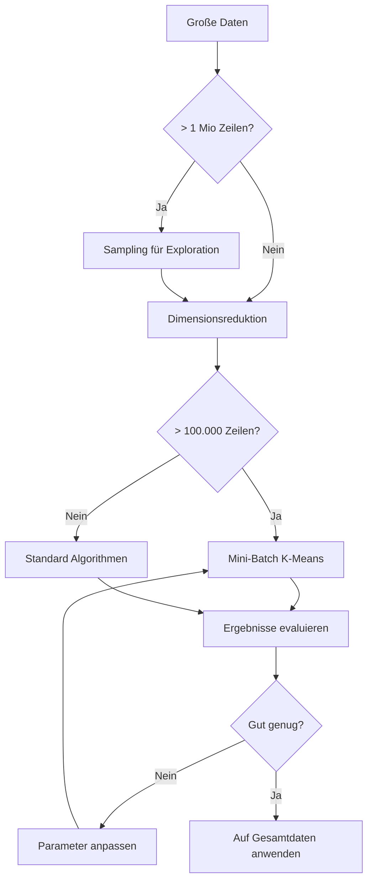

# Große Datenmengen verarbeiten

## Das Skalierungsproblem

Standard-Algorithmen stoßen bei großen Datenmengen an Grenzen:

| Datensatz | K-Means | Hierarchisches Clustering | DBSCAN |
|-----------|---------|---------------------------|--------|
| 1.000 | ✓ Schnell | ✓ Schnell | ✓ Schnell |
| 100.000 | ✓ OK | ⚠ Langsam | ⚠ Langsam |
| 1.000.000 | ⚠ Langsam | ✗ Unmöglich | ✗ Speicherprobleme |
| 10.000.000 | ✗ Speicherprobleme | ✗ Unmöglich | ✗ Unmöglich |

---

## Strategien für große Daten

### 1. Sampling

Arbeite mit einer repräsentativen Stichprobe:

```python
# Zufällige Stichprobe
sample = df.sample(n=10000, random_state=42)

# Stratifiziertes Sampling (wenn Kategorien vorhanden)
from sklearn.model_selection import train_test_split
sample, _ = train_test_split(df, train_size=0.1, stratify=df['category'], random_state=42)
```

!!! warning "Sample-Größe wählen"
    - Minimum: 10.000 Punkte oder 10x Anzahl Features
    - Mehr Cluster = mehr Samples nötig
    - Prüfe: Sind alle Cluster im Sample vertreten?

### 2. Mini-Batch K-Means

Verarbeitet Daten in kleinen Batches:

```python
from sklearn.cluster import MiniBatchKMeans

mbkmeans = MiniBatchKMeans(
    n_clusters=5,
    batch_size=1024,      # Punkte pro Batch
    max_iter=100,
    random_state=42
)

labels = mbkmeans.fit_predict(X_scaled)
```

**Vorteile:**
- 10-100x schneller als Standard K-Means
- Konstanter Speicherverbrauch
- Für Streaming-Daten geeignet

**Nachteile:**
- Leicht schlechtere Ergebnisse
- Ergebnisse weniger stabil

### 3. Daten in Chunks laden

```python
import pandas as pd

# CSV in Chunks lesen
chunks = pd.read_csv('large_file.csv', chunksize=100000)

# Mini-Batch K-Means mit Partial Fit
from sklearn.cluster import MiniBatchKMeans
mbkmeans = MiniBatchKMeans(n_clusters=5, random_state=42)

for i, chunk in enumerate(chunks):
    X_chunk = preprocess(chunk)  # Deine Vorverarbeitung
    mbkmeans.partial_fit(X_chunk)
    print(f"Batch {i+1} verarbeitet")

# Danach: Labels für alle Daten vorhersagen
chunks = pd.read_csv('large_file.csv', chunksize=100000)
all_labels = []
for chunk in chunks:
    X_chunk = preprocess(chunk)
    labels = mbkmeans.predict(X_chunk)
    all_labels.extend(labels)
```

### 4. Dimensionsreduktion zuerst

Reduziere Features vor dem Clustering:

```python
from sklearn.decomposition import IncrementalPCA

# Inkrementelle PCA für große Daten
ipca = IncrementalPCA(n_components=10, batch_size=1000)

# Fit in Batches
for chunk in pd.read_csv('large_file.csv', chunksize=100000):
    X_chunk = preprocess(chunk)
    ipca.partial_fit(X_chunk)

# Transformiere und clustere
X_reduced = ipca.transform(X_scaled)
```

---

## Optimierte Algorithmen

### HDBSCAN statt DBSCAN

```python
import hdbscan

clusterer = hdbscan.HDBSCAN(
    min_cluster_size=100,
    min_samples=10,
    core_dist_n_jobs=-1  # Nutze alle CPU-Kerne
)
labels = clusterer.fit_predict(X_scaled)
```

**Vorteile gegenüber DBSCAN:**
- Automatische Epsilon-Wahl
- Hierarchisches Ergebnis
- Besser für unterschiedliche Dichten

### BallTree für Nachbarschaftssuchen

```python
from sklearn.neighbors import BallTree

# BallTree vorberechnen
tree = BallTree(X_scaled, leaf_size=40)

# Schnelle Nachbarn-Suche
distances, indices = tree.query(X_query, k=5)
```

---

## Speicheroptimierung

### Datentypen reduzieren

```python
def optimize_dtypes(df):
    """Reduziere Speicherverbrauch durch optimierte Datentypen."""
    for col in df.select_dtypes(include=['float64']).columns:
        df[col] = df[col].astype('float32')
    
    for col in df.select_dtypes(include=['int64']).columns:
        if df[col].min() >= 0:
            if df[col].max() < 255:
                df[col] = df[col].astype('uint8')
            elif df[col].max() < 65535:
                df[col] = df[col].astype('uint16')
        else:
            if df[col].min() > -128 and df[col].max() < 128:
                df[col] = df[col].astype('int8')
    
    return df

print(f"Vorher: {df.memory_usage().sum() / 1e6:.1f} MB")
df = optimize_dtypes(df)
print(f"Nachher: {df.memory_usage().sum() / 1e6:.1f} MB")
```

### Sparse Matrices

Für Daten mit vielen Nullwerten (z.B. One-Hot Encoding):

```python
from scipy import sparse

# Dense zu Sparse
X_sparse = sparse.csr_matrix(X)

# K-Means kann mit Sparse arbeiten
kmeans = KMeans(n_clusters=5)
kmeans.fit(X_sparse)
```

---

## Parallelisierung

### Scikit-learn Parallelisierung

```python
from sklearn.cluster import KMeans

# n_jobs=-1 nutzt alle CPU-Kerne
kmeans = KMeans(n_clusters=5, n_init=10, n_jobs=-1)
```

### Joblib für eigene Parallelisierung

```python
from joblib import Parallel, delayed

def fit_single_k(X, k):
    kmeans = KMeans(n_clusters=k, random_state=42)
    kmeans.fit(X)
    return k, kmeans.inertia_, silhouette_score(X, kmeans.labels_)

# Parallele Suche nach optimalem k
results = Parallel(n_jobs=-1)(
    delayed(fit_single_k)(X_scaled, k) 
    for k in range(2, 20)
)
```

---

## Workflow für große Datenmengen



---

## Beispiel: US-Accidents Datensatz

```python
import pandas as pd
from sklearn.cluster import MiniBatchKMeans
from sklearn.preprocessing import StandardScaler

# 1. Sample zum Explorieren
sample = pd.read_csv('us_accidents.csv', nrows=100000)

# 2. Features auswählen und skalieren
features = ['Temperature', 'Humidity', 'Visibility']
X = sample[features].dropna()
scaler = StandardScaler()
X_scaled = scaler.fit_transform(X)

# 3. Optimales k mit Sample finden
from sklearn.metrics import silhouette_score

scores = []
for k in range(2, 10):
    mbkmeans = MiniBatchKMeans(n_clusters=k, batch_size=1000, random_state=42)
    labels = mbkmeans.fit_predict(X_scaled)
    scores.append((k, silhouette_score(X_scaled, labels)))

best_k = max(scores, key=lambda x: x[1])[0]
print(f"Bestes k: {best_k}")

# 4. Finales Modell auf Gesamtdaten trainieren
final_model = MiniBatchKMeans(n_clusters=best_k, batch_size=1024, random_state=42)

for chunk in pd.read_csv('us_accidents.csv', chunksize=50000):
    X_chunk = chunk[features].dropna()
    X_chunk_scaled = scaler.transform(X_chunk)
    final_model.partial_fit(X_chunk_scaled)
```

---

## Zusammenfassung

!!! success "Das Wichtigste"
    - **Sampling:** Nutze Stichproben für Exploration und Parametersuche
    - **Mini-Batch K-Means:** 10-100x schneller, konstanter Speicher
    - **Chunk-Verarbeitung:** `partial_fit()` für Daten größer als RAM
    - **Dimensionsreduktion:** Erst PCA, dann Clustering
    - **Datentypen optimieren:** float64 → float32 spart 50% Speicher

---

??? question "Selbstkontrolle"
    1. Ab welcher Datengröße wird Mini-Batch K-Means empfohlen?
    2. Wie funktioniert Chunk-Verarbeitung in Python?
    3. Wie viel Speicher spart die Umstellung von float64 auf float32?
    4. Was ist der Vorteil von HDBSCAN gegenüber DBSCAN?
    
    ??? success "Antworten"
        1. Ab ca. 100.000 Datenpunkten empfohlen, ab 1 Million notwendig
        2. `pd.read_csv(..., chunksize=N)` + `model.partial_fit()` für jeden Chunk
        3. 50% (8 Bytes → 4 Bytes pro Wert)
        4. Automatische Epsilon-Wahl, hierarchisches Ergebnis, besser für unterschiedliche Dichten
