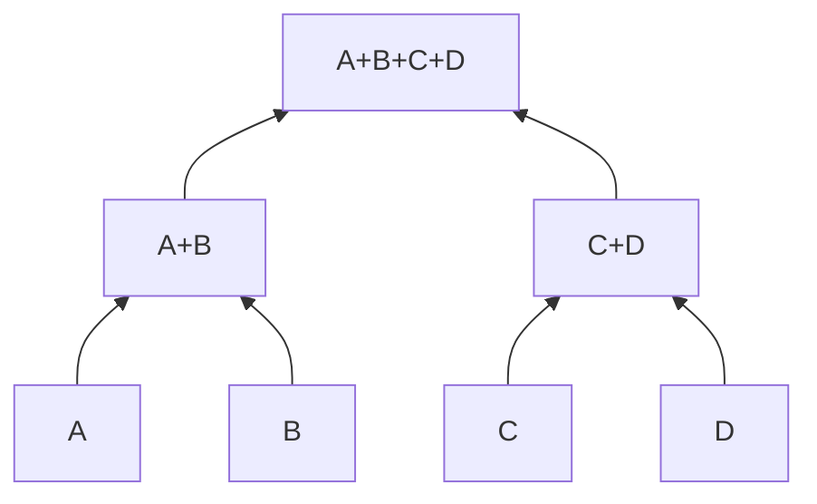

# Hierarchisches Clustering

## Grundidee

Hierarchisches Clustering baut eine **Baumstruktur** (Dendrogramm) auf, die zeigt, wie Datenpunkte schrittweise zu Clustern zusammengefasst werden.

**Vorteil gegenüber K-Means:** Du musst die Clusteranzahl **nicht vorher** festlegen!

---

## Zwei Ansätze

### Agglomerativ (Bottom-Up)

1. Jeder Punkt ist ein eigenes Cluster
2. Verbinde die zwei ähnlichsten Cluster
3. Wiederhole bis nur noch 1 Cluster übrig



### Divisiv (Top-Down)

1. Alle Punkte in einem Cluster
2. Teile rekursiv in kleinere Cluster
3. Wiederhole bis gewünschte Anzahl erreicht

!!! info "In der Praxis"
    **Agglomerativ** ist viel häufiger – einfacher zu implementieren und zu berechnen.

---

## Linkage-Methoden

Die Linkage-Methode bestimmt, wie der **Abstand zwischen Clustern** gemessen wird.

| Methode | Beschreibung | Eigenschaften |
|---------|--------------|---------------|
| `single` | Minimaler Abstand | Kann lange, dünne Cluster bilden |
| `complete` | Maximaler Abstand | Kompakte, ähnlich große Cluster |
| `average` | Durchschnittlicher Abstand | Ausgewogen |
| `ward` | Minimiert Varianz-Zunahme | **Empfohlen für die meisten Fälle** |

```python
from scipy.cluster.hierarchy import linkage

# Verschiedene Linkage-Methoden
Z_ward = linkage(X_scaled, method='ward')
Z_complete = linkage(X_scaled, method='complete')
Z_average = linkage(X_scaled, method='average')
Z_single = linkage(X_scaled, method='single')
```

!!! tip "Best Practice"
    Starte mit **Ward-Linkage** – sie liefert oft die besten Ergebnisse und ist am robustesten.

---

## Dendrogramm erstellen

```python
from scipy.cluster.hierarchy import dendrogram, linkage
import matplotlib.pyplot as plt

# Linkage berechnen
Z = linkage(X_scaled, method='ward')

# Dendrogramm plotten
plt.figure(figsize=(12, 8))
dendrogram(Z, 
           truncate_mode='lastp',  # Nur letzte p Cluster zeigen
           p=30,                   # Anzahl der gezeigten Cluster
           leaf_rotation=90,
           leaf_font_size=10)
plt.xlabel('Datenpunkte')
plt.ylabel('Distanz')
plt.title('Dendrogramm (Ward-Linkage)')
plt.tight_layout()
plt.show()
```

### Dendrogramm interpretieren

- **Y-Achse:** Abstand/Distanz bei der Verschmelzung
- **Horizontale Linien:** Zeigen, welche Cluster verschmolzen werden
- **Höhe der Verschmelzung:** Je höher, desto unähnlicher die Cluster

---

## Cluster aus Dendrogramm ableiten

### Methode 1: Schnitt bei bestimmter Höhe

```python
from scipy.cluster.hierarchy import fcluster

# Schnitt bei Höhe t
labels = fcluster(Z, t=10, criterion='distance')
print(f"Anzahl Cluster: {len(set(labels))}")
```

### Methode 2: Gewünschte Clusteranzahl

```python
# Genau 3 Cluster
labels = fcluster(Z, t=3, criterion='maxclust')
```

### Visualisierung mit Schnittlinie

```python
plt.figure(figsize=(12, 8))
dendrogram(Z, truncate_mode='lastp', p=30)
plt.axhline(y=10, color='r', linestyle='--', label='Schnitt bei t=10')
plt.legend()
plt.show()
```

---

## Mit scikit-learn

```python
from sklearn.cluster import AgglomerativeClustering

# Agglomeratives Clustering
agg = AgglomerativeClustering(
    n_clusters=3,        # Anzahl Cluster
    linkage='ward'       # Linkage-Methode
)
labels = agg.fit_predict(X_scaled)

# Ohne vorgegebene Clusteranzahl (mit distance_threshold)
agg_auto = AgglomerativeClustering(
    n_clusters=None,
    distance_threshold=10,  # Schnitt bei dieser Distanz
    linkage='ward'
)
labels_auto = agg_auto.fit_predict(X_scaled)
```

---

## Vergleich: Hierarchisch vs. K-Means

| Aspekt | K-Means | Hierarchisch |
|--------|---------|--------------|
| **Clusteranzahl** | Muss vorher gewählt werden | Kann nachträglich bestimmt werden |
| **Visualisierung** | Kein natürliches Diagramm | Dendrogramm zeigt Struktur |
| **Geschwindigkeit** | Schnell O(n·k·i) | Langsam O(n³) oder O(n²log n) |
| **Cluster-Form** | Nur kugelförmig | Flexibler |
| **Große Daten** | Gut geeignet | Problematisch (Speicher/Zeit) |
| **Reproduzierbarkeit** | Abhängig von Initialisierung | Deterministisch |

---

## Praktisches Beispiel

```python
import pandas as pd
import numpy as np
from sklearn.preprocessing import StandardScaler
from scipy.cluster.hierarchy import dendrogram, linkage, fcluster
import matplotlib.pyplot as plt

# Daten laden und vorbereiten
df = pd.read_csv('Country-data.csv')
X = df.select_dtypes(include=[np.number])
scaler = StandardScaler()
X_scaled = scaler.fit_transform(X)

# Linkage berechnen
Z = linkage(X_scaled, method='ward')

# Dendrogramm mit Ländernamen
plt.figure(figsize=(15, 10))
dendrogram(Z, 
           labels=df['country'].values,
           leaf_rotation=90,
           leaf_font_size=8)
plt.ylabel('Distanz')
plt.title('Länder-Clustering (Hierarchisch)')
plt.tight_layout()
plt.show()

# 4 Cluster extrahieren
df['Cluster'] = fcluster(Z, t=4, criterion='maxclust')
print(df.groupby('Cluster')['country'].apply(list))
```

---

## Wann Hierarchisches Clustering nutzen?

!!! success "Gut geeignet für"
    - Explorative Analyse (Struktur entdecken)
    - Kleine bis mittlere Datensätze (< 10.000)
    - Wenn Clusteranzahl unklar ist
    - Visualisierung der Cluster-Hierarchie ist wichtig
    - Taxonomien erstellen (z.B. Biologie)

!!! failure "Weniger geeignet für"
    - Sehr große Datensätze (Speicher/Zeit)
    - Echtzeit-Anwendungen
    - Wenn Effizienz kritisch ist

---

## Zusammenfassung

!!! success "Das Wichtigste"
    - Hierarchisches Clustering baut eine Baumstruktur (Dendrogramm) auf
    - **Agglomerativ** (bottom-up) ist der Standard
    - **Ward-Linkage** liefert meist die besten Ergebnisse
    - Clusteranzahl kann **nachträglich** aus dem Dendrogramm abgelesen werden
    - Langsamer als K-Means, aber flexibler

---

??? question "Selbstkontrolle"
    1. Was ist der Unterschied zwischen agglomerativem und divisivem Clustering?
    2. Welche Linkage-Methode ist für den Start empfohlen?
    3. Wie ermittelst du die Clusteranzahl aus einem Dendrogramm?
    4. Wann ist hierarchisches Clustering K-Means vorzuziehen?
    
    ??? success "Antworten"
        1. Agglomerativ: Bottom-up (Punkte → Cluster), Divisiv: Top-down (ein Cluster → viele)
        2. Ward-Linkage – minimiert die Varianz-Zunahme
        3. Horizontale Linie bei gewünschter Höhe ziehen, Anzahl der Schnittpunkte = Clusteranzahl
        4. Wenn Clusteranzahl unklar ist, Visualisierung wichtig ist, oder Datensatz klein ist
