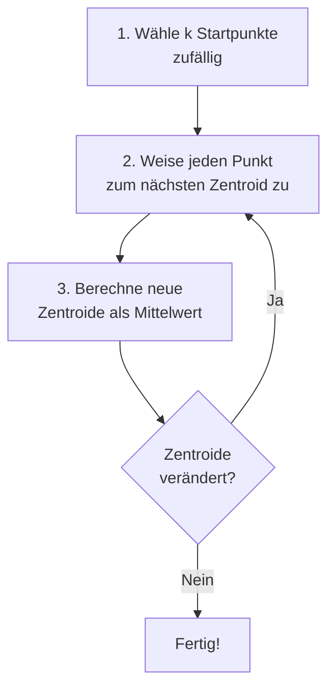

# K-Means Clustering

## Der Algorithmus

K-Means ist der **Standard-Algorithmus** für Clustering – einfach, schnell und oft ausreichend gut.

### Grundidee

K-Means teilt n Datenpunkte in k Cluster, wobei jeder Punkt zum Cluster mit dem **nächsten Zentroid** gehört.

### Schritt für Schritt



1. **Initialisierung:** Wähle k zufällige Punkte als Startzentroids
2. **Zuweisung:** Weise jeden Datenpunkt dem nächsten Zentroid zu
3. **Update:** Berechne neue Zentroids als Mittelwert der zugewiesenen Punkte
4. **Wiederhole** Schritte 2-3 bis Konvergenz

!!! tip "Interaktive Visualisierung"
    Probiere den Algorithmus interaktiv aus: [K-Means Visualisierung von Naftali Harris](https://www.naftaliharris.com/blog/visualizing-k-means-clustering/){ target="_blank" }

---

## Code-Beispiel

```python
from sklearn.cluster import KMeans
from sklearn.preprocessing import StandardScaler
import pandas as pd

# Daten vorbereiten
df = pd.read_csv('Country-data.csv')
X = df.select_dtypes(include=['number'])
scaler = StandardScaler()
X_scaled = scaler.fit_transform(X)

# K-Means mit 3 Clustern
kmeans = KMeans(n_clusters=3, random_state=42)
labels = kmeans.fit_predict(X_scaled)

# Labels dem DataFrame hinzufügen
df['Cluster'] = labels

# Cluster-Zentroide
print(kmeans.cluster_centers_)

# Inertia (Within-Cluster Sum of Squares)
print(f"Inertia: {kmeans.inertia_:.2f}")
```

---

## Die Elbow-Methode

**Problem:** Wie viele Cluster (k) sind optimal?

**Lösung:** Die Elbow-Methode findet den Punkt, ab dem mehr Cluster kaum noch Verbesserung bringen.

```python
import matplotlib.pyplot as plt

inertias = []
K_range = range(1, 11)

for k in K_range:
    kmeans = KMeans(n_clusters=k, random_state=42)
    kmeans.fit(X_scaled)
    inertias.append(kmeans.inertia_)

# Elbow-Plot
plt.figure(figsize=(10, 6))
plt.plot(K_range, inertias, 'bo-')
plt.xlabel('Anzahl Cluster (k)')
plt.ylabel('Inertia (WCSS)')
plt.title('Elbow-Methode')
plt.xticks(K_range)
plt.grid(True)
plt.show()
```

!!! tip "Den Ellbogen finden"
    Der optimale k-Wert liegt dort, wo die Kurve einen **Knick** macht – wie ein Ellbogen. Danach flacht die Verbesserung ab.

---

## Silhouette Score

Der Silhouette Score misst, wie gut Punkte zu ihrem eigenen Cluster passen vs. zu anderen Clustern.

$$s(i) = \frac{b(i) - a(i)}{\max(a(i), b(i))}$$

- **a(i):** Mittlere Distanz zu Punkten im eigenen Cluster
- **b(i):** Mittlere Distanz zum nächsten fremden Cluster

| Wert | Interpretation |
|------|----------------|
| 1.0 | Perfekt getrennt |
| 0.5 - 1.0 | Gute Trennung |
| 0.25 - 0.5 | Schwache Trennung |
| < 0.25 | Cluster überlappen |
| < 0 | Falsche Clusterzuordnung |

```python
from sklearn.metrics import silhouette_score

# Silhouette Score für verschiedene k
for k in range(2, 8):
    kmeans = KMeans(n_clusters=k, random_state=42)
    labels = kmeans.fit_predict(X_scaled)
    score = silhouette_score(X_scaled, labels)
    print(f"k={k}: Silhouette Score = {score:.3f}")
```

---

## Initialisierung: k-means++

Das Problem mit zufälliger Initialisierung: Schlechte Startpunkte führen zu schlechten Ergebnissen.

**k-means++** wählt Startpunkte intelligent:
1. Erster Zentroid zufällig
2. Nächster Zentroid: weit weg von existierenden (gewichtete Wahrscheinlichkeit)
3. Wiederhole bis k Zentroids gewählt

```python
# k-means++ ist der Default in scikit-learn
kmeans = KMeans(n_clusters=3, init='k-means++', random_state=42)

# Alternative: zufällig
kmeans_random = KMeans(n_clusters=3, init='random', random_state=42)
```

!!! success "Best Practice"
    Immer `random_state` setzen für reproduzierbare Ergebnisse!

---

## Wichtige Parameter

| Parameter | Default | Beschreibung |
|-----------|---------|--------------|
| `n_clusters` | 8 | Anzahl Cluster |
| `init` | 'k-means++' | Initialisierungsmethode |
| `n_init` | 10 | Anzahl Durchläufe mit verschiedenen Seeds |
| `max_iter` | 300 | Maximale Iterationen |
| `random_state` | None | Seed für Reproduzierbarkeit |

```python
kmeans = KMeans(
    n_clusters=5,
    init='k-means++',
    n_init=10,        # 10 Durchläufe, bestes Ergebnis nehmen
    max_iter=300,
    random_state=42
)
```

---

## Vor- und Nachteile

| Vorteile | Nachteile |
|----------|-----------|
| ✅ Einfach zu verstehen | ❌ k muss vorher gewählt werden |
| ✅ Schnell (O(n·k·i)) | ❌ Nur kugelförmige Cluster |
| ✅ Skaliert gut | ❌ Empfindlich gegen Ausreißer |
| ✅ Garantiert Konvergenz | ❌ Findet nur lokales Optimum |

---

## Wann K-Means (nicht) verwenden

!!! success "K-Means ist gut für"
    - Kugelförmige, ähnlich große Cluster
    - Erste Exploration der Daten
    - Große Datensätze (schnell!)
    - Klare Trennung zwischen Gruppen

!!! failure "K-Means ist schlecht für"
    - Nicht-kugelförmige Cluster (Halbmonde, Ringe)
    - Cluster sehr unterschiedlicher Größe
    - Daten mit vielen Ausreißern
    - Wenn k unbekannt und schwer zu schätzen

---

## Visualisierung der Ergebnisse

```python
import matplotlib.pyplot as plt
from sklearn.decomposition import PCA

# Bei mehr als 2 Features: PCA für Visualisierung
pca = PCA(n_components=2)
X_pca = pca.fit_transform(X_scaled)

# Scatter-Plot mit Cluster-Farben
plt.figure(figsize=(10, 8))
scatter = plt.scatter(X_pca[:, 0], X_pca[:, 1], 
                      c=labels, cmap='viridis', alpha=0.6)
plt.colorbar(scatter, label='Cluster')
plt.xlabel('PC1')
plt.ylabel('PC2')
plt.title('K-Means Clustering (PCA-Visualisierung)')
plt.show()
```

---

## Zusammenfassung

!!! success "Das Wichtigste"
    - K-Means teilt Daten in k Cluster basierend auf Zentroiden
    - **Elbow-Methode** hilft bei der Wahl von k
    - **Silhouette Score** bewertet die Clustering-Qualität
    - Immer `random_state` setzen für Reproduzierbarkeit
    - Daten müssen vorher skaliert werden!

---

??? question "Selbstkontrolle"
    1. Was macht K-Means in jedem Iterationsschritt?
    2. Was zeigt die Elbow-Methode?
    3. Was bedeutet ein Silhouette Score von 0.7?
    4. Warum ist k-means++ besser als zufällige Initialisierung?
    
    ??? success "Antworten"
        1. Punkte dem nächsten Zentroid zuweisen, dann Zentroide als Mittelwert neu berechnen
        2. Wie sich die Inertia (Kompaktheit) mit steigender Clusteranzahl verändert
        3. Gute Trennung der Cluster – Punkte sind näher am eigenen als an fremden Clustern
        4. Bessere Startpunkte führen zu besseren und konsistenteren Ergebnissen
