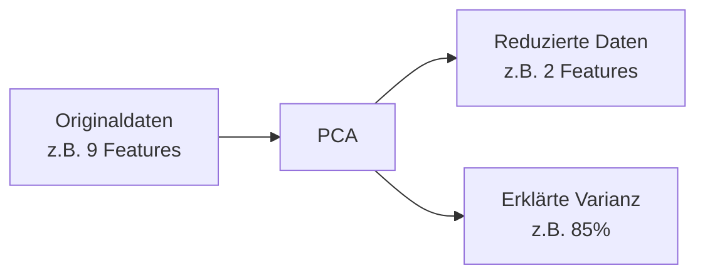

# PCA (Dimensionsreduktion)

## Was ist PCA?

**PCA** (Principal Component Analysis / Hauptkomponentenanalyse) reduziert die Anzahl der Features, während möglichst viel Information erhalten bleibt.

**Hauptanwendungen:**
- Visualisierung hochdimensionaler Daten (z.B. 50D → 2D)
- Rauschunterdrückung
- Beschleunigung anderer Algorithmen
- Feature-Engineering

---

## Die Grundidee


PCA findet neue Achsen (Hauptkomponenten), die:
1. **Orthogonal** zueinander stehen
2. Die **Varianz** der Daten maximieren



!!! example "Analogie"
    Stell dir vor, du fotografierst eine 3D-Skulptur. Der beste Winkel zeigt die meiste Information auf einem 2D-Bild. PCA findet automatisch diesen "besten Winkel".

---

## Code-Beispiel

```python
from sklearn.decomposition import PCA
from sklearn.preprocessing import StandardScaler
import matplotlib.pyplot as plt

# 1. Daten skalieren (wichtig für PCA!)
scaler = StandardScaler()
X_scaled = scaler.fit_transform(X)

# 2. PCA anwenden
pca = PCA(n_components=2)  # Auf 2 Dimensionen reduzieren
X_pca = pca.fit_transform(X_scaled)

# 3. Ergebnis visualisieren
plt.figure(figsize=(10, 8))
plt.scatter(X_pca[:, 0], X_pca[:, 1], alpha=0.6)
plt.xlabel('PC1')
plt.ylabel('PC2')
plt.title('Daten nach PCA (2D)')
plt.show()
```

---

## Erklärte Varianz

Die **erklärte Varianz** zeigt, wie viel Information jede Komponente enthält.

```python
# PCA mit allen Komponenten
pca_full = PCA()
pca_full.fit(X_scaled)

# Erklärte Varianz pro Komponente
print("Varianz pro Komponente:")
print(pca_full.explained_variance_ratio_)

# Kumulierte Varianz
cumsum = np.cumsum(pca_full.explained_variance_ratio_)
print(f"\nKumuliert: {cumsum}")
```

### Scree-Plot (Varianz visualisieren)

```python
import matplotlib.pyplot as plt
import numpy as np

# Erklärte Varianz plotten
plt.figure(figsize=(10, 6))

# Balken für einzelne Komponenten
plt.bar(range(1, len(pca_full.explained_variance_ratio_) + 1),
        pca_full.explained_variance_ratio_, alpha=0.7, label='Einzeln')

# Linie für kumulierte Varianz
plt.plot(range(1, len(cumsum) + 1), cumsum, 'ro-', label='Kumuliert')

plt.xlabel('Hauptkomponente')
plt.ylabel('Erklärte Varianz')
plt.title('Scree-Plot')
plt.axhline(y=0.95, color='g', linestyle='--', label='95% Schwelle')
plt.legend()
plt.show()
```

---

## Wahl der Komponentenanzahl

### Methode 1: Prozentsatz der Varianz

```python
# 95% der Varianz erhalten
pca = PCA(n_components=0.95)
X_reduced = pca.fit_transform(X_scaled)

print(f"Anzahl Komponenten: {pca.n_components_}")
print(f"Erklärte Varianz: {sum(pca.explained_variance_ratio_):.2%}")
```

### Methode 2: Feste Anzahl

```python
# Genau 2 Komponenten für Visualisierung
pca = PCA(n_components=2)
X_2d = pca.fit_transform(X_scaled)
```

### Faustregel

| Erklärte Varianz | Interpretation |
|------------------|----------------|
| > 95% | Sehr gut, fast keine Information verloren |
| 80-95% | Gut für die meisten Anwendungen |
| < 80% | Möglicherweise zu viel Information verloren |

---

## Features interpretieren

Welche Original-Features stecken in den Hauptkomponenten?

```python
# Komponenten-Matrix (Loadings)
loadings = pd.DataFrame(
    pca.components_.T,
    columns=['PC1', 'PC2'],
    index=feature_names
)
print(loadings)

# Visualisierung als Heatmap
import seaborn as sns
plt.figure(figsize=(10, 8))
sns.heatmap(loadings, annot=True, cmap='coolwarm', center=0)
plt.title('Feature-Beiträge zu den Hauptkomponenten')
plt.show()
```

!!! tip "Interpretation"
    Hohe absolute Werte zeigen, dass ein Feature stark zur Komponente beiträgt. Das Vorzeichen zeigt die Richtung.

---

## PCA + Clustering kombinieren

```python
from sklearn.cluster import KMeans

# 1. PCA für Dimensionsreduktion
pca = PCA(n_components=2)
X_pca = pca.fit_transform(X_scaled)

# 2. K-Means auf reduzierten Daten
kmeans = KMeans(n_clusters=3, random_state=42)
labels = kmeans.fit_predict(X_pca)

# 3. Visualisierung
plt.figure(figsize=(10, 8))
scatter = plt.scatter(X_pca[:, 0], X_pca[:, 1], c=labels, cmap='viridis')
plt.colorbar(scatter, label='Cluster')
plt.xlabel(f'PC1 ({pca.explained_variance_ratio_[0]:.1%})')
plt.ylabel(f'PC2 ({pca.explained_variance_ratio_[1]:.1%})')
plt.title('K-Means Clustering nach PCA')
plt.show()
```

---

## Alternativen zu PCA

| Methode | Typ | Wann verwenden |
|---------|-----|----------------|
| **PCA** | Linear | Standard, schnell, interpretierbar |
| **t-SNE** | Nicht-linear | Visualisierung, lokale Strukturen |
| **UMAP** | Nicht-linear | Schneller als t-SNE, globale + lokale Struktur |

### Kurz: t-SNE

```python
from sklearn.manifold import TSNE

tsne = TSNE(n_components=2, random_state=42, perplexity=30)
X_tsne = tsne.fit_transform(X_scaled)

# Achtung: t-SNE ist langsam und nicht reproduzierbar ohne random_state!
```

!!! warning "t-SNE Einschränkungen"
    - Nur für Visualisierung (nicht für Clustering!)
    - Abstände haben keine Bedeutung
    - Sehr langsam bei großen Daten
    - Parameter `perplexity` beeinflusst Ergebnis stark

---

## Häufige Fehler

| Fehler | Problem | Lösung |
|--------|---------|--------|
| Nicht skaliert | Features mit großen Werten dominieren | StandardScaler vor PCA |
| Zu wenig Varianz | Information verloren | Mehr Komponenten wählen |
| Auf Testdaten fitten | Data Leakage | Nur auf Trainingsdaten fitten |

```python
# Richtig: fit auf Train, transform auf Test
pca.fit(X_train_scaled)
X_train_pca = pca.transform(X_train_scaled)
X_test_pca = pca.transform(X_test_scaled)
```

---

## Zusammenfassung

!!! success "Das Wichtigste"
    - PCA reduziert Dimensionen unter Erhalt der Varianz
    - **Immer skalieren** vor PCA!
    - `explained_variance_ratio_` zeigt, wie viel Information erhalten bleibt
    - 2-3 Komponenten für Visualisierung, mehr für andere Anwendungen
    - PCA + Clustering ist eine starke Kombination

---

??? question "Selbstkontrolle"
    1. Was maximiert PCA?
    2. Warum ist Skalierung vor PCA wichtig?
    3. Was bedeutet eine erklärte Varianz von 85%?
    4. Wann ist t-SNE besser als PCA?
    
    ??? success "Antworten"
        1. Die Varianz entlang der neuen Achsen (Hauptkomponenten)
        2. Ohne Skalierung dominieren Features mit großen Werten
        3. 85% der Information aus den Originaldaten bleibt erhalten, 15% gehen verloren
        4. Für Visualisierung nicht-linearer Strukturen (aber nicht für Clustering!)
