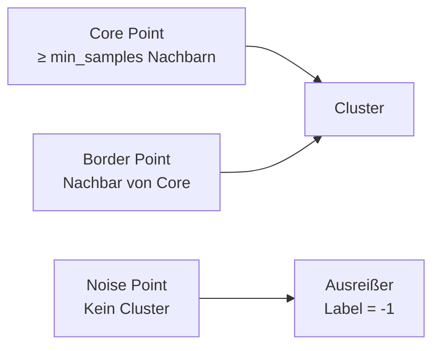
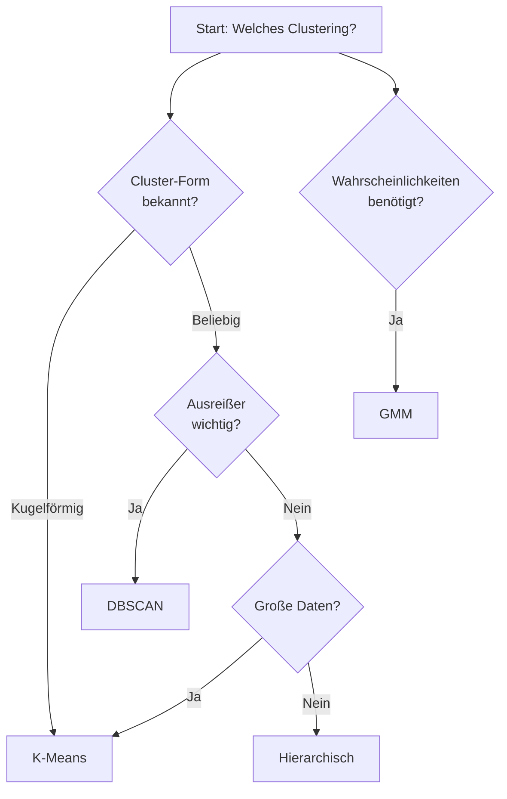

# Weitere Clustering-Algorithmen

## Überblick

Neben K-Means und hierarchischem Clustering gibt es weitere Algorithmen mit unterschiedlichen Stärken.

| Algorithmus | Typ | Hauptvorteil |
|-------------|-----|--------------|
| **DBSCAN** | Dichtebasiert | Findet Ausreißer, beliebige Formen |
| **GMM** | Probabilistisch | Weiche Zuordnung, elliptische Cluster |
| **Mean Shift** | Dichtebasiert | Findet k automatisch |

---

## DBSCAN

**DBSCAN** (Density-Based Spatial Clustering of Applications with Noise) gruppiert Punkte basierend auf **Dichte**.

### Grundkonzept

- **Core Points:** Punkte mit mindestens `min_samples` Nachbarn im Radius `eps`
- **Border Points:** Im Radius eines Core Points, aber selbst kein Core Point
- **Noise:** Weder Core noch Border → **Ausreißer!**



### Code-Beispiel

```python
from sklearn.cluster import DBSCAN
import matplotlib.pyplot as plt

# DBSCAN anwenden
dbscan = DBSCAN(eps=0.5, min_samples=5)
labels = dbscan.fit_predict(X_scaled)

# Anzahl Cluster (ohne Noise)
n_clusters = len(set(labels)) - (1 if -1 in labels else 0)
n_noise = list(labels).count(-1)

print(f"Cluster: {n_clusters}")
print(f"Ausreißer: {n_noise}")
```

### Parameter tunen

**eps finden mit k-Distance Plot:**

```python
from sklearn.neighbors import NearestNeighbors
import numpy as np

# k-nächste Nachbarn berechnen
k = 5  # = min_samples
nn = NearestNeighbors(n_neighbors=k)
nn.fit(X_scaled)
distances, _ = nn.kneighbors(X_scaled)

# Sortierte Distanzen plotten
distances = np.sort(distances[:, k-1])
plt.figure(figsize=(10, 6))
plt.plot(distances)
plt.xlabel('Punkte (sortiert)')
plt.ylabel(f'Distanz zum {k}. Nachbarn')
plt.title('k-Distance Plot zur eps-Bestimmung')
plt.axhline(y=0.5, color='r', linestyle='--', label='Mögliches eps')
plt.legend()
plt.show()
```

!!! tip "eps wählen"
    Der "Ellbogen" im k-Distance Plot zeigt einen guten eps-Wert.

### Vor- und Nachteile

| Vorteile | Nachteile |
|----------|-----------|
| ✅ Findet beliebige Clusterformen | ❌ Parameter eps & min_samples kritisch |
| ✅ Erkennt Ausreißer automatisch | ❌ Problematisch bei unterschiedlichen Dichten |
| ✅ k muss nicht gewählt werden | ❌ Langsamer als K-Means |

---

## Gaussian Mixture Models (GMM)

GMM modelliert Daten als Mischung von **Gaußverteilungen**. Anders als K-Means gibt GMM **Wahrscheinlichkeiten** für die Clusterzugehörigkeit.

### Grundidee

- Jedes Cluster ist eine Gaußverteilung (Normalverteilung)
- Jeder Punkt hat eine Wahrscheinlichkeit für jedes Cluster
- **Weiche Zuordnung** statt harter Labels

### Code-Beispiel

```python
from sklearn.mixture import GaussianMixture

# GMM anwenden
gmm = GaussianMixture(n_components=3, random_state=42)
gmm.fit(X_scaled)

# Harte Labels
labels = gmm.predict(X_scaled)

# Wahrscheinlichkeiten pro Cluster
probabilities = gmm.predict_proba(X_scaled)
print("Wahrscheinlichkeiten für ersten Punkt:")
print(probabilities[0])  # z.B. [0.02, 0.95, 0.03]
```

### Kovarianz-Typen

```python
# Verschiedene Kovarianz-Typen
gmm_full = GaussianMixture(n_components=3, covariance_type='full')    # Flexibel
gmm_diag = GaussianMixture(n_components=3, covariance_type='diag')    # Achsenparallel
gmm_spherical = GaussianMixture(n_components=3, covariance_type='spherical')  # Kugelförmig
```

| Typ | Beschreibung | Freiheitsgrade |
|-----|--------------|----------------|
| `full` | Beliebige Ellipsen | Hoch |
| `tied` | Alle Cluster gleiche Form | Mittel |
| `diag` | Achsenparallele Ellipsen | Niedrig |
| `spherical` | Kugeln (wie K-Means) | Sehr niedrig |

### Modellauswahl mit BIC/AIC

```python
import numpy as np

# Verschiedene Clusteranzahlen testen
bic_scores = []
aic_scores = []
K_range = range(1, 10)

for k in K_range:
    gmm = GaussianMixture(n_components=k, random_state=42)
    gmm.fit(X_scaled)
    bic_scores.append(gmm.bic(X_scaled))
    aic_scores.append(gmm.aic(X_scaled))

# Bestes k ist das mit niedrigstem BIC
best_k = K_range[np.argmin(bic_scores)]
print(f"Optimale Clusteranzahl (BIC): {best_k}")
```

### Vor- und Nachteile

| Vorteile | Nachteile |
|----------|-----------|
| ✅ Weiche Zuordnung (Wahrscheinlichkeiten) | ❌ Langsamer als K-Means |
| ✅ Elliptische Cluster möglich | ❌ Anfällig für lokale Optima |
| ✅ BIC/AIC für Modellwahl | ❌ Benötigt mehr Daten |

---

## Algorithmen-Vergleich

| Aspekt | K-Means | Hierarchisch | DBSCAN | GMM |
|--------|---------|--------------|--------|-----|
| **k wählen** | Ja | Nein* | Nein | Ja |
| **Ausreißer** | Nein | Nein | Ja! | Bedingt |
| **Cluster-Form** | Kugel | Flexibel | Beliebig | Ellipse |
| **Zuordnung** | Hart | Hart | Hart | Weich |
| **Geschwindigkeit** | Sehr schnell | Langsam | Mittel | Mittel |
| **Große Daten** | Gut | Schlecht | Mittel | Mittel |

*Kann nachträglich aus Dendrogramm abgelesen werden

---

## Wann welchen Algorithmus?



!!! success "Faustregel"
    1. **Starte mit K-Means** – schnell und oft gut genug
    2. **DBSCAN** wenn Ausreißer wichtig oder Cluster nicht kugelförmig
    3. **Hierarchisch** für Exploration und kleine Datensätze
    4. **GMM** wenn Wahrscheinlichkeiten oder elliptische Cluster nötig

---

## Zusammenfassung

!!! success "Das Wichtigste"
    - **DBSCAN:** Dichtebasiert, findet Ausreißer, beliebige Formen
    - **GMM:** Probabilistisch, weiche Zuordnung, elliptische Cluster
    - Kein Algorithmus ist universell überlegen
    - Starte mit K-Means, dann Alternativen testen

---

??? question "Selbstkontrolle"
    1. Was bedeutet Label = -1 bei DBSCAN?
    2. Was ist der Vorteil von GMM gegenüber K-Means?
    3. Wann ist DBSCAN K-Means vorzuziehen?
    4. Wie findest du den eps-Parameter für DBSCAN?
    
    ??? success "Antworten"
        1. Ausreißer/Noise – der Punkt gehört zu keinem Cluster
        2. Weiche Zuordnung (Wahrscheinlichkeiten) statt harter Labels
        3. Bei nicht-kugelförmigen Clustern oder wenn Ausreißer-Erkennung wichtig ist
        4. k-Distance Plot: Distanz zum k-ten Nachbarn sortiert plotten, Ellbogen finden
