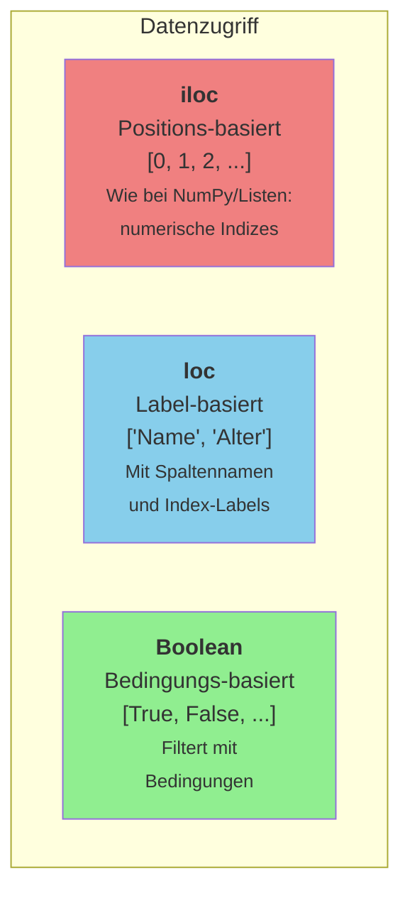

# Pandas – Datenzugriff mit loc und iloc

## Lernziele

Nach Bearbeitung dieses Arbeitsblatts kannst du:

- gezielt auf Zeilen und Spalten zugreifen mit `loc` und `iloc`
- den Unterschied zwischen label- und positionsbasiertem Zugriff verstehen
- Boolean Indexing für komplexe Filter anwenden
- Daten effizient auswählen und manipulieren

!!! note "Begleitende Infoblätter"
    - [:material-book-open-variant: Pandas Datenzugriff](../infoblaetter/pandas-datenzugriff.md) – loc, iloc, Boolean Indexing
    - [:material-book-open-variant: Pandas Grundlagen](../infoblaetter/pandas-grundlagen.md)
    
    Lies die Infoblätter **zuerst**, bevor du die Aufgaben bearbeitest. Dort findest du alle Syntax-Beispiele und Erklärungen.

---

## Einführung

Pandas bietet verschiedene Wege, auf Daten zuzugreifen. Die wichtigsten sind `loc` (label-basiert) und `iloc` (positions-basiert).

**Bearbeite alle Aufgaben in einem Jupyter Notebook.**

**Spaltenübersicht für den MBA-Datensatz:**

| Spalte | Beschreibung |
|--------|--------------|
| Application_ID | Eindeutige ID der Bewerbung |
| Gender | Geschlecht |
| International | Internationaler Bewerber? (Yes/No) |
| GPA | Grade Point Average (Notenschnitt) |
| Major | Studienfach |
| Work_Experience | Berufserfahrung in Jahren |
| Decision | Entscheidung (Admit/Waitlist/Deny) |

!!! abstract "Datensatz herunterladen"
    [:material-download: mba_decisions.csv](../assets/files/mba_decisions.csv){ .md-button }

---

## Aufgaben

### Aufgabe 1 – Datensatz laden und erkunden

Lade den MBA-Decisions Datensatz und verschaffe dir einen Überblick.

- [ ] Importiere Pandas und NumPy
- [ ] Lade die Datei `mba_decisions.csv` aus dem `assets/files`-Ordner
- [ ] Gib die Shape des Datensatzes aus
- [ ] Zeige alle Spaltennamen an
- [ ] Zeige die ersten 5 Zeilen an
- [ ] Nutze `info()` um einen Überblick über Datentypen und fehlende Werte zu bekommen

!!! tip "Hilfe"
    - Datei laden: `pd.read_csv(pfad)`
    - Shape: `df.shape`
    - Spaltennamen: `df.columns.tolist()`
    - Erste Zeilen: `df.head()`
    - Infos: `df.info()`

---

### Aufgabe 2 – iloc: Positions-basierter Zugriff

`iloc` nutzt **numerische Positionen** (0-basiert), wie bei Listen.

- [ ] Wähle die **erste Zeile** des DataFrames aus (als Series)
- [ ] Wähle die erste Zeile als **DataFrame** aus (Tipp: doppelte Klammern)
- [ ] Wähle die **ersten 3 Zeilen** mit Slicing aus
- [ ] Wähle die Zeilen mit Index **0, 5 und 10** gleichzeitig aus
- [ ] Greife auf den Wert in **Zeile 0, Spalte 3** zu (einzelner Wert)
- [ ] Wähle einen **Bereich**: Zeilen 0-2 und Spalten 0-3
- [ ] Wähle bestimmte Zeilen **[0, 5, 10]** und bestimmte Spalten **[1, 3, 5]** aus
- [ ] Wähle die **letzten 3 Zeilen** mit negativen Indizes aus
- [ ] Wähle die **vorletzte Zeile** aus

!!! tip "Hilfe"
    - Einzelne Zeile als Series: `df.iloc[index]`
    - Einzelne Zeile als DataFrame: `df.iloc[[index]]`
    - Slicing: `df.iloc[start:ende]` (Ende exklusiv!)
    - Bestimmte Zeilen: `df.iloc[[0, 5, 10]]`
    - Zeile und Spalte: `df.iloc[zeile, spalte]`
    - Bereich: `df.iloc[z_start:z_ende, s_start:s_ende]`
    - Negative Indizes: `df.iloc[-3:]` für letzte 3 Zeilen

---

### Aufgabe 3 – loc: Label-basierter Zugriff

`loc` nutzt **Labels** (Spaltennamen und Index-Werte).

- [ ] Wähle die Spalte `GPA` für **alle Zeilen** aus und zeige die ersten 5 Werte
- [ ] Wähle die Spalten `Gender`, `GPA` und `Decision` für alle Zeilen aus
- [ ] Wähle die **Zeilen 0-4** (inklusiv!) und die **Spalten von Gender bis GPA** aus
- [ ] Vergleiche das Slicing-Verhalten: Erstelle eine Ausgabe für `iloc[0:3]` und `loc[0:3]` – wie viele Zeilen erhältst du jeweils?

!!! tip "Hilfe"
    - Alle Zeilen, eine Spalte: `df.loc[:, 'Spaltenname']`
    - Mehrere Spalten: `df.loc[:, ['Spalte1', 'Spalte2']]`
    - Zeilen und Spalten: `df.loc[z_start:z_ende, 's_start':'s_ende']`
    - **Wichtig:** Bei `loc` ist das Ende inklusiv, bei `iloc` exklusiv!

!!! warning "Vorsicht bei loc-Slicing"
    Bei `loc` ist das Ende **inklusiv**: `loc[0:3]` gibt 4 Zeilen zurück!
    Bei `iloc` ist das Ende **exklusiv**: `iloc[0:3]` gibt 3 Zeilen zurück!

---

### Aufgabe 4 – Boolean Indexing Grundlagen

Filtere Daten mit Bedingungen – der mächtigste Zugriffsmodus!

- [ ] Filtere alle Bewerber mit **GPA > 3.5** und gib die Anzahl aus
- [ ] Speichere die Bedingung `mba['GPA'] > 3.5` in einer Variable und zeige die ersten 10 Werte der Boolean-Series
- [ ] Zähle, wie viele `True`-Werte die Bedingung enthält (Tipp: `.sum()`)
- [ ] Filtere mit der gespeicherten Bedingung und vergleiche die Anzahl mit dem sum()-Ergebnis

!!! tip "Hilfe"
    - Einfacher Filter: `df[df['Spalte'] > wert]`
    - Bedingung speichern: `bedingung = df['Spalte'] > wert`
    - True-Werte zählen: `bedingung.sum()`
    - Mit Bedingung filtern: `df[bedingung]`

---

### Aufgabe 5 – Mehrere Bedingungen kombinieren

Kombiniere mehrere Filterbedingungen mit logischen Operatoren.

- [ ] Finde alle **"Elite-Bewerber"**: GPA > 3.5 **UND** Work_Experience > 5
- [ ] Finde alle **interessanten Bewerber**: GPA > 3.8 **ODER** Work_Experience > 10
- [ ] Finde alle **nicht-internationalen Bewerber** (International != 'Yes')
- [ ] Finde alle Bewerber mit GPA **zwischen 3.2 und 3.7** (inklusive)
- [ ] Finde alle **internationalen Bewerber, die abgelehnt wurden**

!!! tip "Hilfe"
    - UND-Verknüpfung: `(bedingung1) & (bedingung2)` – Klammern wichtig!
    - ODER-Verknüpfung: `(bedingung1) | (bedingung2)`
    - NICHT: `~(bedingung)` oder `!=`
    - Bereich: `(df['Spalte'] >= min) & (df['Spalte'] <= max)`

!!! warning "Klammern nicht vergessen!"
    Bei mehreren Bedingungen **müssen** die einzelnen Bedingungen in Klammern stehen:
    `df[(bed1) & (bed2)]` ✓
    `df[bed1 & bed2]` ✗

---

### Aufgabe 6 – Filtern mit Textbedingungen

Filtere nach Textwerten und nutze spezielle String-Methoden.

- [ ] Filtere alle **aufgenommenen Bewerber** (Decision == 'Admit') und zähle sie
- [ ] Filtere alle **abgelehnten Bewerber** (Decision == 'Deny') und zähle sie
- [ ] Zeige alle **einzigartigen Werte** der Spalte `Major` an
- [ ] Filtere alle Bewerber, deren Major in einer Liste von Werten vorkommt (z.B. `['STEM', 'Business']`)
- [ ] Erkunde die String-Methoden: Lass dir die ersten 10 verfügbaren `str`-Methoden anzeigen

!!! tip "Hilfe"
    - Gleichheit bei Text: `df['Spalte'] == 'Wert'`
    - Einzigartige Werte: `df['Spalte'].unique()`
    - Prüfen ob in Liste: `df['Spalte'].isin(['Wert1', 'Wert2'])`
    - String-Methoden: `df['Spalte'].str.contains()`, `.str.startswith()`, etc.
    - Methoden auflisten: `dir(df['Spalte'].str)`

---

### Aufgabe 7 – loc mit Bedingungen kombinieren

`loc` erlaubt Bedingungen UND Spaltenauswahl in einem Schritt.

- [ ] Filtere alle aufgenommenen Bewerber mit GPA > 3.5 und zeige nur die Spalten `Gender`, `GPA`, `Work_Experience` und `Major`
- [ ] Erstelle eine **Kopie** des DataFrames (wichtig für Änderungen!)
- [ ] Erhöhe in der Kopie den GPA aller internationalen Bewerber um 0.1
- [ ] Vergleiche den durchschnittlichen GPA der internationalen Bewerber vor und nach der Änderung

!!! tip "Hilfe"
    - Filter + Spaltenauswahl: `df.loc[bedingung, ['Spalte1', 'Spalte2']]`
    - Kopie erstellen: `df_kopie = df.copy()`
    - Werte ändern: `df.loc[bedingung, 'Spalte'] = neuer_wert`
    - Werte erhöhen: `df.loc[bedingung, 'Spalte'] += wert`

---

## Vertiefende Aufgaben

!!! tip "Optionale Aufgaben zur Vertiefung"
    Die folgenden Aufgaben sind **optional** und vertiefen das Gelernte. Sie eignen sich besonders für:
    
    - **Query-Methode als elegante SQL-ähnliche Alternative**
    - **Komplexere Filterszenarien mit mehreren Bedingungen**
    - **Prüfungsvorbereitung** durch eigenständiges Arbeiten

---

### Aufgabe 8 – Query-Methode als Alternative

Die `query()`-Methode ermöglicht SQL-ähnliche Filterung.

- [ ] Filtere alle Bewerber mit GPA > 3.5 mit der `query()`-Methode
- [ ] Filtere alle aufgenommenen Bewerber (Achtung: Anführungszeichen bei Strings!)
- [ ] Kombiniere mehrere Bedingungen: GPA > 3.5 **und** Work_Experience > 3
- [ ] Nutze eine **Variable** in der Query: Speichere einen Mindestwert und referenziere ihn mit `@`

!!! tip "Hilfe"
    - Einfache Query: `df.query('Spalte > wert')`
    - String-Vergleich: `df.query('Spalte == "Wert"')` (verschiedene Anführungszeichen!)
    - AND/OR: `df.query('bed1 and bed2')` oder `df.query('bed1 or bed2')`
    - Variable nutzen: `min_wert = 3.5` → `df.query('GPA > @min_wert')`

!!! info "query() Vorteile"
    - Lesbarere Syntax bei komplexen Bedingungen
    - Keine Klammern und & nötig
    - Variablen mit `@` einbinden
    - Schneller bei sehr großen DataFrames

---

### Aufgabe 9 – Praktische Analysen

Wende dein Wissen in realistischen Analyseszenarien an.

- [ ] **Aufnahme-Analyse**: Berechne für jede Entscheidungskategorie (Admit/Waitlist/Deny) die Anzahl, den durchschnittlichen GPA und die durchschnittliche Berufserfahrung
- [ ] **International vs. Nicht-International**: Berechne für beide Gruppen die Anzahl Bewerber, die Anzahl Aufgenommener und die Aufnahmequote in Prozent
- [ ] **Top-Bewerber**: Finde die 10 Bewerber mit dem höchsten GPA und zeige Gender, GPA, Work_Experience und Decision
- [ ] **Überraschende Ablehnungen**: Finde Bewerber mit GPA > 3.7, die dennoch abgelehnt wurden
- [ ] **Überraschende Aufnahmen**: Finde Bewerber mit GPA < 3.0, die dennoch aufgenommen wurden

!!! tip "Hilfe"
    - Für jede Kategorie: Schleife über `.unique()` oder benutze `.groupby()` (später)
    - Top N Werte: `df.nlargest(n, 'Spalte')`
    - Bottom N Werte: `df.nsmallest(n, 'Spalte')`
    - Prozent berechnen: `(teil / gesamt) * 100`

---

### Aufgabe 10 – Komplexe Analyseaufgaben

!!! warning "Ohne Hilfe lösen"
    Bearbeite diese Aufgaben selbstständig.

**Aufgabe A: Aufnahmekriterien erforschen**

- [ ] Was ist der minimale GPA, mit dem jemand aufgenommen wurde?
- [ ] Was ist der maximale GPA, mit dem jemand abgelehnt wurde?
- [ ] Gibt es Bewerber, die trotz niedrigem GPA (<3.0) aufgenommen wurden? Was haben diese gemeinsam?

**Aufgabe B: Fairness-Analyse**

- [ ] Berechne die Aufnahmequote (Anteil Admit) für:
    - Männer vs. Frauen
    - International vs. Nicht-International
    - Jeden Major separat
- [ ] Gibt es auffällige Unterschiede?

**Aufgabe C: Grenzfälle identifizieren**

- [ ] Finde "knapp Abgelehnte": GPA > 3.5, Erfahrung > 5, aber Decision = Deny
- [ ] Finde "Glücksfälle": GPA < 3.2, Erfahrung < 3, aber Decision = Admit
- [ ] Analysiere diese Gruppen: Gibt es weitere Merkmale, die sie verbinden?

**Aufgabe D: Eigene Query-Formulierung**

- [ ] Formuliere 5 komplexe Queries mit der `query()`-Methode:
    1. Eine Kombination aus 3 Bedingungen mit AND und OR
    2. Eine Query mit einer Variablen (@variable)
    3. Eine Query mit Vergleich zwischen zwei Spalten
    4. ...
    5. ...

**Aufgabe E: Datenmanipulation**

- [ ] Erstelle eine Kopie des DataFrames
- [ ] Setze alle GPA-Werte von abgelehnten Bewerbern auf NaN
- [ ] Zähle, wie viele Werte du geändert hast
- [ ] Berechne den neuen Durchschnitts-GPA (ohne die NaN-Werte)

---

## Zusammenfassung

!!! success "Das hast du gelernt"
    - **iloc**: Positions-basiert mit Zahlen, Ende exklusiv bei Slicing
    - **loc**: Label-basiert mit Namen, Ende inklusiv bei Slicing
    - **Boolean Indexing**: `df[bedingung]` für mächtige Filter
    - **Operatoren**: `&` (und), `|` (oder), `~` (nicht) + Klammern!
    - **isin()**: Prüfen ob Werte in Liste enthalten
    - **query()**: SQL-ähnliche Syntax für komplexe Filter
    - **nlargest/nsmallest**: Schnell Top-N finden

---

??? question "Selbstkontrolle"
    1. Was ist der Unterschied zwischen `df.iloc[0:3]` und `df.loc[0:3]`?
    2. Wie filterst du nach zwei Bedingungen mit AND?
    3. Wie wählst du Zeilen nach Bedingung UND nur bestimmte Spalten aus?
    4. Was macht `df[df['col'].isin(['A', 'B'])]`?
    
    ??? success "Antworten"
        1. `iloc[0:3]` gibt 3 Zeilen (0,1,2), `loc[0:3]` gibt 4 Zeilen (0,1,2,3) weil Ende inklusiv
        2. `df[(df['a'] > 5) & (df['b'] < 10)]` – Klammern und `&` wichtig!
        3. `df.loc[df['a'] > 5, ['spalte1', 'spalte2']]`
        4. Filtert alle Zeilen, wo 'col' entweder 'A' oder 'B' enthält
