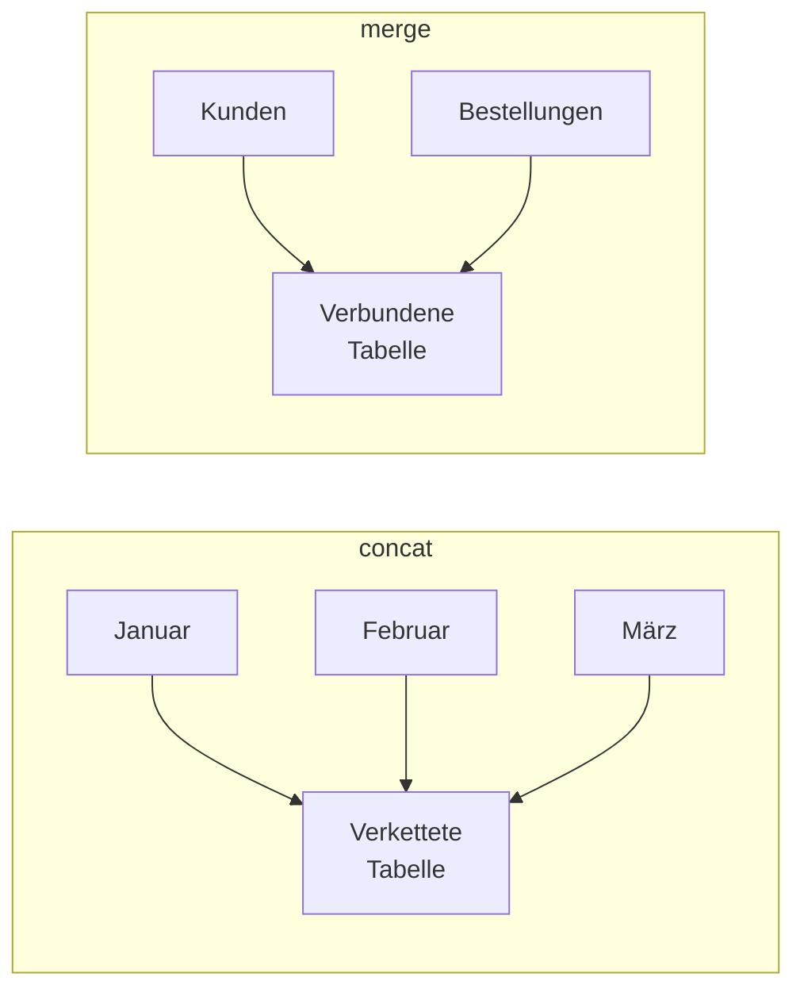

# Pandas – DataFrames verbinden

## Lernziele

Nach Bearbeitung dieses Arbeitsblatts kannst du:

- DataFrames mit `pd.concat()` verketten
- DataFrames mit `pd.merge()` zusammenführen (Joins)
- den Unterschied zwischen verschiedenen Join-Typen verstehen
- Daten aus mehreren Quellen kombinieren

!!! note "Begleitendes Infoblatt"
    [:material-book-open-variant: Pandas Grundlagen](../infoblaetter/pandas-grundlagen.md)
    
    Lies das Infoblatt **zuerst**, bevor du die Aufgaben bearbeitest.

---

## Einführung

In der Praxis liegen Daten oft in mehreren Tabellen vor. Um sie zu analysieren, müssen sie kombiniert werden:

- **Verketten (`concat`)**: Tabellen untereinander oder nebeneinander anfügen
- **Zusammenführen (`merge`)**: Tabellen über gemeinsame Spalten verbinden (wie SQL JOIN)

**Bearbeite alle Aufgaben in einem Jupyter Notebook.**

---

## Teil 1: Verketten mit concat()

### Aufgabe 1 – Grundlagen concat()

Erstelle zwei einfache DataFrames und verknüpfe sie.

```python
import pandas as pd

# Verkaufsdaten Januar
jan = pd.DataFrame({
    'Produkt': ['A', 'B', 'C'],
    'Umsatz': [100, 150, 200]
})

# Verkaufsdaten Februar
feb = pd.DataFrame({
    'Produkt': ['A', 'B', 'C'],
    'Umsatz': [120, 130, 250]
})
```

- [ ] Verkette `jan` und `feb` untereinander mit `pd.concat([jan, feb])`
- [ ] Beachte den Index – was fällt auf?
- [ ] Nutze `ignore_index=True` um einen fortlaufenden Index zu erhalten
- [ ] Füge eine Spalte `Monat` hinzu, bevor du verkettst

!!! tip "Hilfe"
    - Untereinander: `pd.concat([df1, df2])` (Standard: `axis=0`)
    - Nebeneinander: `pd.concat([df1, df2], axis=1)`
    - Index zurücksetzen: `pd.concat([df1, df2], ignore_index=True)`

---

### Aufgabe 2 – concat() mit unterschiedlichen Spalten

Was passiert, wenn DataFrames unterschiedliche Spalten haben?

```python
df1 = pd.DataFrame({
    'Name': ['Max', 'Anna'],
    'Alter': [25, 30]
})

df2 = pd.DataFrame({
    'Name': ['Tom', 'Lisa'],
    'Stadt': ['Berlin', 'München']
})
```

- [ ] Verkette `df1` und `df2` – was passiert mit fehlenden Spalten?
- [ ] Teste `pd.concat([df1, df2], join='inner')` – was ändert sich?
- [ ] Erkläre den Unterschied zwischen `join='outer'` (Standard) und `join='inner'`

!!! tip "Hilfe"
    - `join='outer'`: Alle Spalten behalten, fehlende Werte werden NaN
    - `join='inner'`: Nur gemeinsame Spalten behalten

---

### Aufgabe 3 – Horizontales Verketten

Füge DataFrames nebeneinander zusammen.

```python
namen = pd.DataFrame({
    'Name': ['Max', 'Anna', 'Tom']
})

details = pd.DataFrame({
    'Alter': [25, 30, 28],
    'Stadt': ['Berlin', 'München', 'Hamburg']
})
```

- [ ] Verkette `namen` und `details` nebeneinander mit `axis=1`
- [ ] Was passiert, wenn die DataFrames unterschiedlich viele Zeilen haben?

---

## Teil 2: Zusammenführen mit merge()

### Aufgabe 4 – Grundlagen merge()

Verbinde zwei Tabellen über eine gemeinsame Spalte.

```python
# Kundendaten
kunden = pd.DataFrame({
    'KundenID': [1, 2, 3, 4],
    'Name': ['Max', 'Anna', 'Tom', 'Lisa']
})

# Bestellungen
bestellungen = pd.DataFrame({
    'BestellID': [101, 102, 103, 104, 105],
    'KundenID': [1, 2, 1, 3, 2],
    'Betrag': [50, 75, 30, 100, 45]
})
```

- [ ] Verbinde `kunden` und `bestellungen` über `KundenID` mit `pd.merge()`
- [ ] Wie viele Zeilen hat das Ergebnis? Warum?
- [ ] Welcher Kunde hat die meisten Bestellungen?

!!! tip "Hilfe"
    - Einfacher Merge: `pd.merge(df1, df2, on='gemeinsame_spalte')`
    - Oder: `df1.merge(df2, on='gemeinsame_spalte')`

---

### Aufgabe 5 – Join-Typen verstehen

Lerne die vier wichtigen Join-Typen kennen.

```python
# Nicht alle Kunden haben bestellt
kunden = pd.DataFrame({
    'KundenID': [1, 2, 3, 4, 5],  # Kunde 5 hat nicht bestellt
    'Name': ['Max', 'Anna', 'Tom', 'Lisa', 'Jan']
})

bestellungen = pd.DataFrame({
    'KundenID': [1, 2, 6],  # Kunde 6 existiert nicht
    'Betrag': [50, 75, 100]
})
```

- [ ] Teste `pd.merge(kunden, bestellungen, on='KundenID', how='inner')` – was ist im Ergebnis?
- [ ] Teste `how='left'` – welche Kunden sind dabei?
- [ ] Teste `how='right'` – welche Bestellungen sind dabei?
- [ ] Teste `how='outer'` – was enthält das Ergebnis?

!!! tip "Hilfe"
    | Join-Typ | Beschreibung |
    |----------|--------------|
    | `inner` | Nur Zeilen mit Übereinstimmung in beiden Tabellen |
    | `left` | Alle Zeilen aus linker Tabelle, Matches aus rechter |
    | `right` | Alle Zeilen aus rechter Tabelle, Matches aus linker |
    | `outer` | Alle Zeilen aus beiden Tabellen |

??? question "Reflexionsfrage"
    Wann würdest du `left` vs. `inner` Join verwenden? Denke an einen Anwendungsfall.

---

### Aufgabe 6 – Merge mit unterschiedlichen Spaltennamen

Was tun, wenn die Schlüsselspalten unterschiedlich heißen?

```python
mitarbeiter = pd.DataFrame({
    'MitarbeiterNr': [101, 102, 103],
    'Name': ['Max', 'Anna', 'Tom']
})

gehalt = pd.DataFrame({
    'PersonalID': [101, 102, 103],
    'Gehalt': [3500, 4200, 3800]
})
```

- [ ] Verbinde die Tabellen mit `left_on` und `right_on`
- [ ] Entferne die doppelte ID-Spalte aus dem Ergebnis

!!! tip "Hilfe"
    ```python
    pd.merge(df1, df2, left_on='spalte_df1', right_on='spalte_df2')
    ```

---

### Aufgabe 7 – Merge auf Index

Verbinde DataFrames über ihren Index.

```python
# DataFrame mit KundenID als Index
kunden = pd.DataFrame({
    'Name': ['Max', 'Anna', 'Tom']
}, index=[1, 2, 3])
kunden.index.name = 'KundenID'

# Bestellungen mit KundenID als Spalte
bestellungen = pd.DataFrame({
    'KundenID': [1, 2, 1],
    'Betrag': [50, 75, 30]
})
```

- [ ] Verbinde über `left_index=True` und `right_on='KundenID'`
- [ ] Alternativ: Nutze `kunden.reset_index()` und dann normaler Merge

!!! tip "Hilfe"
    - Index als Schlüssel links: `left_index=True`
    - Index als Schlüssel rechts: `right_index=True`

---

## Vertiefende Aufgaben

!!! info "Vertiefung"
    Diese Aufgaben festigen dein Wissen und zeigen fortgeschrittene Anwendungen:
    
    - **Aufgabe 8**: Multi-Key Merges
    - **Aufgabe 9**: Praktische Anwendung mit echten Daten
    - **Aufgabe 10**: Eigenständige Analyse

---

### Aufgabe 8 – Merge auf mehreren Spalten

Manchmal reicht eine Spalte nicht zur eindeutigen Zuordnung.

```python
# Verkäufe pro Filiale und Produkt
verkauf_2023 = pd.DataFrame({
    'Filiale': ['Nord', 'Nord', 'Süd', 'Süd'],
    'Produkt': ['A', 'B', 'A', 'B'],
    'Umsatz_2023': [100, 150, 120, 180]
})

verkauf_2024 = pd.DataFrame({
    'Filiale': ['Nord', 'Nord', 'Süd', 'Süd'],
    'Produkt': ['A', 'B', 'A', 'B'],
    'Umsatz_2024': [110, 140, 130, 200]
})
```

- [ ] Verbinde über beide Spalten: `on=['Filiale', 'Produkt']`
- [ ] Berechne das Wachstum pro Filiale/Produkt

---

### Aufgabe 9 – Praxisbeispiel: Daten anreichern

Kombiniere Bestelldaten mit Produkt- und Kundeninformationen.

```python
# Produkte
produkte = pd.DataFrame({
    'ProduktID': ['P1', 'P2', 'P3'],
    'Produktname': ['Laptop', 'Maus', 'Tastatur'],
    'Kategorie': ['Computer', 'Zubehör', 'Zubehör']
})

# Kunden
kunden = pd.DataFrame({
    'KundenID': ['K1', 'K2', 'K3'],
    'Kundenname': ['Firma A', 'Firma B', 'Firma C'],
    'Region': ['Nord', 'Süd', 'West']
})

# Bestellungen
bestellungen = pd.DataFrame({
    'BestellID': [1, 2, 3, 4, 5],
    'KundenID': ['K1', 'K2', 'K1', 'K3', 'K2'],
    'ProduktID': ['P1', 'P2', 'P3', 'P1', 'P1'],
    'Menge': [2, 5, 3, 1, 2],
    'Preis': [1000, 25, 50, 1000, 1000]
})
```

- [ ] Reichere `bestellungen` mit Produktinformationen an
- [ ] Reichere das Ergebnis mit Kundeninformationen an
- [ ] Berechne den Gesamtumsatz pro Region und Kategorie

!!! tip "Hilfe"
    Du kannst mehrere Merges verketten:
    ```python
    result = bestellungen.merge(produkte, on='ProduktID').merge(kunden, on='KundenID')
    ```

---

### Aufgabe 10 – Eigenständige Analyse

!!! warning "Ohne Hilfe lösen"
    Bearbeite diese Aufgaben selbstständig.

**Szenario:** Du hast drei CSV-Dateien (simuliert):

```python
# Simulierte Daten erstellen
import numpy as np
np.random.seed(42)

# Mitarbeiter
mitarbeiter = pd.DataFrame({
    'MitarbeiterID': range(1, 11),
    'Name': [f'Person_{i}' for i in range(1, 11)],
    'Abteilung': np.random.choice(['IT', 'HR', 'Sales'], 10)
})

# Projekte
projekte = pd.DataFrame({
    'ProjektID': range(101, 106),
    'Projektname': ['Web-App', 'Mobile', 'Analytics', 'Cloud', 'Security'],
    'Budget': [50000, 30000, 45000, 60000, 35000]
})

# Zuweisungen (welcher Mitarbeiter arbeitet an welchem Projekt)
zuweisungen = pd.DataFrame({
    'MitarbeiterID': [1, 1, 2, 3, 4, 5, 6, 7, 8, 2, 3, 5],
    'ProjektID': [101, 102, 101, 103, 101, 104, 105, 101, 102, 103, 104, 105],
    'Stunden': np.random.randint(10, 100, 12)
})
```

**Aufgaben:**

A) Erstelle eine Übersicht: Welcher Mitarbeiter arbeitet an welchen Projekten?

B) Berechne die Gesamtstunden pro Projekt und füge den Projektnamen hinzu.

C) Welche Abteilung hat die meisten Projektstunden?

D) Gibt es Mitarbeiter ohne Projektzuweisung? (Hint: `left` join + `isna()`)

E) Berechne das "Kosten pro Stunde"-Verhältnis: Budget / Gesamtstunden pro Projekt

---

## Zusammenfassung

!!! success "Das hast du gelernt"
    **concat() – Verketten:**
    
    - `pd.concat([df1, df2])` – untereinander (axis=0)
    - `pd.concat([df1, df2], axis=1)` – nebeneinander
    - `ignore_index=True` – fortlaufender Index
    - `join='inner'` / `'outer'` – Spaltenbehandlung
    
    **merge() – Zusammenführen:**
    
    - `pd.merge(df1, df2, on='spalte')` – einfacher Join
    - `how='inner'` / `'left'` / `'right'` / `'outer'` – Join-Typen
    - `left_on`, `right_on` – unterschiedliche Spaltennamen
    - `left_index`, `right_index` – Join auf Index

---

## Übersicht: concat vs. merge

| Methode | Anwendung | Beispiel |
|---------|-----------|----------|
| `concat` | Tabellen gleicher Struktur stapeln | Monatsdaten zusammenfügen |
| `merge` | Tabellen über Schlüssel verbinden | Bestellungen + Kundendaten |



---

??? question "Selbstkontrolle"
    1. Was ist der Unterschied zwischen `concat()` und `merge()`?
    2. Welcher Join-Typ behält alle Zeilen aus der linken Tabelle?
    3. Was passiert bei `concat()` mit `ignore_index=False` (Standard)?
    4. Wie verbindest du zwei Tabellen, wenn die Schlüsselspalten unterschiedlich heißen?
    
    ??? success "Antworten"
        1. `concat` stapelt Tabellen, `merge` verbindet über gemeinsame Werte
        2. `how='left'`
        3. Die ursprünglichen Indizes bleiben erhalten (evtl. doppelte Indizes)
        4. `pd.merge(df1, df2, left_on='spalte1', right_on='spalte2')`
