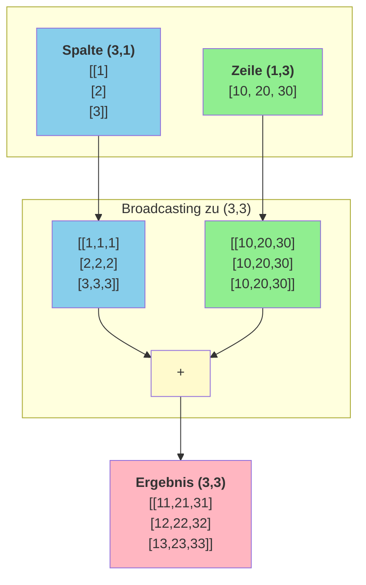

# NumPy Broadcasting

## Was ist Broadcasting?

Broadcasting ist ein mächtiges Konzept, das es ermöglicht, arithmetische Operationen auf Arrays **unterschiedlicher Größe** durchzuführen. NumPy "erweitert" dabei automatisch das kleinere Array, um es kompatibel zu machen.

!!! info "Broadcasting vs. Normale Operationen"
    **Ohne Broadcasting:** Arrays müssen die gleiche Form haben für arithmetische Operationen.
    
    **Mit Broadcasting:** NumPy "dehnt" kleinere Arrays virtuell aus – ohne zusätzlichen Speicher zu verbrauchen!

---

## Einfaches Beispiel

### Skalar + Array

```python
import numpy as np

arr = np.array([1, 2, 3, 4, 5])
ergebnis = arr + 10

print(ergebnis)  # [11 12 13 14 15]
```

**Was passiert intern:**

```kroki-plantuml
@startuml
!theme plain
skinparam backgroundColor transparent

rectangle "arr = [1, 2, 3, 4, 5]" as arr #lightblue
rectangle "10" as scalar #lightyellow
rectangle "10 → [10, 10, 10, 10, 10]" as expanded #lightgreen
rectangle "Ergebnis: [11, 12, 13, 14, 15]" as result #white

arr --> result : "+"
scalar --> expanded : "Broadcasting"
expanded --> result
@enduml
```

Der Skalar `10` wird "gebroadcastet" zu `[10, 10, 10, 10, 10]`, aber ohne tatsächlich Speicher zu verbrauchen!

---

## Broadcasting-Regeln

NumPy vergleicht die Formen (shapes) von rechts nach links:

### Regel 1: Gleiche Dimension oder 1

Zwei Dimensionen sind kompatibel, wenn sie:
- **gleich** sind, ODER
- **eine davon 1** ist

### Regel 2: Fehlende Dimensionen

Wenn ein Array weniger Dimensionen hat, wird es links mit 1en aufgefüllt.

**Broadcasting-Regeln:**

| Regel | Beschreibung |
|-------|-------------|
| 1. Form-Vergleich | Dimensionen werden von **rechts nach links** verglichen |
| 2. Kompatibilität | Zwei Dimensionen sind kompatibel, wenn sie **gleich** sind oder eine davon **1** ist |
| 3. Fehlende Dimensionen | Werden links mit **1** aufgefüllt |

### Beispiele für kompatible Formen

| Array A | Array B | Ergebnis | Kompatibel? |
|---------|---------|----------|-------------|
| (3, 4) | (4,) | (3, 4) | ✅ Ja |
| (3, 4) | (3, 1) | (3, 4) | ✅ Ja |
| (3, 4) | (1, 4) | (3, 4) | ✅ Ja |
| (3, 4) | (3,) | Fehler | ❌ Nein |
| (5, 3, 4) | (3, 4) | (5, 3, 4) | ✅ Ja |
| (5, 3, 4) | (5, 1, 4) | (5, 3, 4) | ✅ Ja |

---

## Praktische Beispiele

### Beispiel 1: Zeilen-/Spaltenweise Operationen

```python
# 3x4 Matrix
matrix = np.array([[1, 2, 3, 4],
                   [5, 6, 7, 8],
                   [9, 10, 11, 12]])

# Jede Zeile mit anderem Wert multiplizieren
zeilen_faktoren = np.array([[1], [2], [3]])  # Shape (3, 1)
print(matrix * zeilen_faktoren)
# [[ 1  2  3  4]    # Zeile 0 × 1
#  [10 12 14 16]    # Zeile 1 × 2
#  [27 30 33 36]]   # Zeile 2 × 3

# Jede Spalte mit anderem Wert multiplizieren
spalten_faktoren = np.array([1, 2, 3, 4])  # Shape (4,)
print(matrix * spalten_faktoren)
# [[ 1  4  9 16]    # Spalten × [1,2,3,4]
#  [ 5 12 21 32]
#  [ 9 20 33 48]]
```

### Beispiel 2: Normalisierung

```python
# Daten: 4 Messungen, 3 Sensoren
daten = np.array([[100, 200, 150],
                  [120, 180, 160],
                  [110, 220, 140],
                  [130, 190, 170]])

# Spaltenweise Normalisierung (Min-Max)
min_vals = daten.min(axis=0)  # [100, 180, 140]
max_vals = daten.max(axis=0)  # [130, 220, 170]

# Broadcasting: daten (4,3) - min_vals (3,) → (4,3)
normalisiert = (daten - min_vals) / (max_vals - min_vals)
print(normalisiert)
# [[0.         0.5        0.33333333]
#  [0.66666667 0.         0.66666667]
#  [0.33333333 1.         0.        ]
#  [1.         0.25       1.        ]]
```

### Beispiel 3: Zeilenweise Mittelwertabzug

```python
matrix = np.array([[10, 20, 30],
                   [40, 50, 60],
                   [70, 80, 90]])

# Mittelwert jeder Zeile
zeilen_mean = matrix.mean(axis=1, keepdims=True)  # Shape (3, 1)
print(zeilen_mean)
# [[20.]
#  [50.]
#  [80.]]

# Mittelwert abziehen (Zentrierung)
zentriert = matrix - zeilen_mean
print(zentriert)
# [[-10.   0.  10.]
#  [-10.   0.  10.]
#  [-10.   0.  10.]]
```

!!! tip "keepdims=True"
    Mit `keepdims=True` behält das Ergebnis die ursprüngliche Anzahl an Dimensionen. Das erleichtert Broadcasting erheblich!

---

## Visualisierung des Broadcastings

### Spaltenvektor + Zeilenvektor

```python
spalte = np.array([[1], [2], [3]])  # Shape (3, 1)
zeile = np.array([10, 20, 30])       # Shape (3,) → (1, 3)

ergebnis = spalte + zeile
print(ergebnis)
# [[11 21 31]
#  [12 22 32]
#  [13 23 33]]
```



```python
# Code-Beispiel
spalte = np.array([[1], [2], [3]])   # Shape: (3,1)
zeile = np.array([10, 20, 30])        # Shape: (3,) → wird zu (1,3)

ergebnis = spalte + zeile             # Broadcasting: (3,1) + (1,3) → (3,3)
print(ergebnis)
# [[11 21 31]
#  [12 22 32]
#  [13 23 33]]
```

---

## Häufige Anwendungsfälle

### 1. Skalierung von Daten

```python
# Preise in verschiedenen Währungen
preise_eur = np.array([10, 20, 30, 40])
wechselkurse = np.array([[1.0],      # EUR
                         [1.1],      # USD
                         [0.85]])    # GBP

# Alle Preise in allen Währungen
alle_preise = preise_eur * wechselkurse
print(alle_preise)
# [[10.   20.   30.   40.  ]  # EUR
#  [11.   22.   33.   44.  ]  # USD
#  [ 8.5  17.   25.5  34.  ]] # GBP
```

### 2. One-Hot Encoding prüfen

```python
# Kategorien als Zahlen
kategorien = np.array([0, 2, 1, 0, 2])

# Vergleich mit allen möglichen Werten
alle_werte = np.array([[0], [1], [2]])  # Shape (3, 1)

# Broadcasting: (3,1) mit (5,) → (3,5)
one_hot = (kategorien == alle_werte).astype(int)
print(one_hot.T)  # Transponiert für bessere Lesbarkeit
# [[1 0 0]
#  [0 0 1]
#  [0 1 0]
#  [1 0 0]
#  [0 0 1]]
```

### 3. Distanzmatrix

```python
# 4 Punkte in 1D
punkte = np.array([1, 3, 6, 10])

# Distanz zwischen allen Punktpaaren
# Broadcasting: (4,1) - (1,4) → (4,4)
distanzen = np.abs(punkte.reshape(-1, 1) - punkte)
print(distanzen)
# [[0 2 5 9]
#  [2 0 3 7]
#  [5 3 0 4]
#  [9 7 4 0]]
```

---

## Fehler vermeiden

### Inkompatible Formen

```python
a = np.array([[1, 2, 3],
              [4, 5, 6]])  # Shape (2, 3)

b = np.array([1, 2])       # Shape (2,)

# Fehler! (3) und (2) sind nicht kompatibel
# a + b  # ValueError: operands could not be broadcast together
```

### Lösung: Reshape

```python
# Option 1: b als Spalte
b_spalte = b.reshape(-1, 1)  # Shape (2, 1)
print(a + b_spalte)
# [[2 3 4]
#  [6 7 8]]

# Option 2: b transponieren mit np.newaxis
b_neu = b[:, np.newaxis]  # Shape (2, 1)
print(a + b_neu)
```

---

## Performance-Vorteil

Broadcasting ist nicht nur praktisch, sondern auch **schnell**:

```python
import time

# Große Matrix
matrix = np.random.rand(10000, 1000)
vektor = np.random.rand(1000)

# Mit Broadcasting (SCHNELL)
start = time.time()
ergebnis1 = matrix + vektor
print(f"Broadcasting: {time.time() - start:.4f}s")

# Mit expliziter Erweiterung (LANGSAMER, mehr Speicher)
start = time.time()
vektor_erweitert = np.tile(vektor, (10000, 1))
ergebnis2 = matrix + vektor_erweitert
print(f"Mit tile: {time.time() - start:.4f}s")
```

**Broadcasting ist schneller, weil:**
- Kein zusätzlicher Speicher allokiert wird
- Die Erweiterung nur "virtuell" stattfindet
- Optimierte C-Routinen verwendet werden

---

## Zusammenfassung

!!! success "Das Wichtigste"
    - **Broadcasting** ermöglicht Operationen auf Arrays unterschiedlicher Größe
    - **Regeln**: Dimensionen müssen gleich oder 1 sein (von rechts nach links)
    - **keepdims=True** erleichtert Broadcasting bei Aggregationen
    - **np.newaxis** oder **reshape** helfen bei der Formanpassung
    - Broadcasting ist **speichereffizient** und **schnell**

---

??? question "Selbstkontrolle"
    1. Welche Form hat das Ergebnis von `(3, 1) + (4,)`?
    2. Sind die Formen `(5, 3)` und `(3,)` kompatibel?
    3. Wie machst du einen 1D-Array (n,) zu einem Spaltenvektor (n, 1)?
    4. Was bewirkt `keepdims=True` bei `np.mean()`?
    
    ??? success "Antworten"
        1. `(3, 4)` - die 1 wird zu 4 gebroadcastet
        2. Ja! `(3,)` wird zu `(1, 3)` → `(5, 3)`
        3. `arr.reshape(-1, 1)` oder `arr[:, np.newaxis]`
        4. Es behält die Dimension bei, z.B. `(3, 4)` → `(3, 1)` statt `(3,)`
