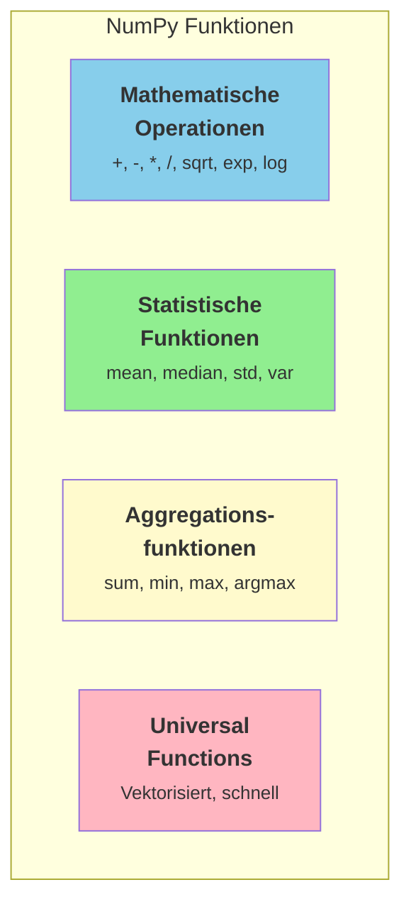

# NumPy Funktionen & Statistik

## Übersicht

NumPy bietet eine umfangreiche Sammlung von mathematischen und statistischen Funktionen, die auf Arrays angewendet werden können.



---

## Mathematische Operationen

### Arithmetische Operationen

Alle Operationen sind **element-weise** (vektorisiert):

```python
import numpy as np

a = np.array([1, 2, 3, 4])
b = np.array([10, 20, 30, 40])

print(a + b)   # [11 22 33 44]
print(a - b)   # [-9 -18 -27 -36]
print(a * b)   # [10 40 90 160]
print(a / b)   # [0.1 0.1 0.1 0.1]
print(a ** 2)  # [1 4 9 16]
print(b % 3)   # [1 2 0 1] (Modulo)
print(b // 3)  # [3 6 10 13] (Ganzzahldivision)
```

### Mathematische Funktionen

| Funktion | Beschreibung | Beispiel |
|----------|--------------|----------|
| `np.sqrt(x)` | Quadratwurzel | `np.sqrt(16)` → 4.0 |
| `np.exp(x)` | Exponentialfunktion | `np.exp(1)` → 2.718... |
| `np.log(x)` | Natürlicher Logarithmus | `np.log(2.718)` → ~1.0 |
| `np.log10(x)` | Zehnerlogarithmus | `np.log10(100)` → 2.0 |
| `np.sin(x)`, `np.cos(x)` | Trigonometrisch | Im Bogenmaß |
| `np.abs(x)` | Absolutwert | `np.abs(-5)` → 5 |
| `np.round(x, n)` | Runden | `np.round(3.14159, 2)` → 3.14 |
| `np.floor(x)` | Abrunden | `np.floor(3.7)` → 3.0 |
| `np.ceil(x)` | Aufrunden | `np.ceil(3.2)` → 4.0 |

```python
arr = np.array([1, 4, 9, 16, 25])

print(np.sqrt(arr))   # [1. 2. 3. 4. 5.]
print(np.log(arr))    # [0.    1.39  2.2   2.77  3.22]
print(np.exp(arr))    # [2.72e+00 5.46e+01 8.10e+03 ...]
```

---

## Statistische Funktionen

### Grundlegende Statistik

```kroki-plantuml
@startuml
!theme plain
skinparam backgroundColor transparent

rectangle "Daten: [2, 4, 4, 4, 5, 5, 7, 9]" as data #lightgray

rectangle "mean()\nMittelwert\n= 5.0" as mean #lightblue
rectangle "median()\nMedian\n= 4.5" as median #lightgreen
rectangle "std()\nStandardabw.\n= 2.0" as std #lightyellow
rectangle "var()\nVarianz\n= 4.0" as var #lightpink

data --> mean
data --> median
data --> std
data --> var
@enduml
```

| Funktion | Beschreibung | Formel |
|----------|--------------|--------|
| `np.mean(arr)` | Mittelwert | $\bar{x} = \frac{1}{n}\sum_{i=1}^{n} x_i$ |
| `np.median(arr)` | Median | Mittlerer Wert |
| `np.std(arr)` | Standardabweichung | $\sigma = \sqrt{\frac{1}{n}\sum_{i=1}^{n}(x_i - \bar{x})^2}$ |
| `np.var(arr)` | Varianz | $\sigma^2$ |
| `np.percentile(arr, p)` | Perzentil | p%-Wert |

```python
daten = np.array([2, 4, 4, 4, 5, 5, 7, 9])

print(f"Mittelwert: {np.mean(daten)}")       # 5.0
print(f"Median: {np.median(daten)}")         # 4.5
print(f"Standardabw.: {np.std(daten):.2f}")  # 2.0
print(f"Varianz: {np.var(daten)}")           # 4.0

# Perzentile
print(f"25. Perzentil: {np.percentile(daten, 25)}")  # 4.0
print(f"75. Perzentil: {np.percentile(daten, 75)}")  # 5.5
```

### Methodenaufruf

Die meisten Funktionen können auch als Methoden aufgerufen werden:

```python
arr = np.array([1, 2, 3, 4, 5])

# Als Funktion
print(np.mean(arr))  # 3.0

# Als Methode
print(arr.mean())    # 3.0 - gleich!
```

---

## Aggregationsfunktionen

### Grundlegende Aggregation

| Funktion | Beschreibung | Beispiel |
|----------|--------------|----------|
| `np.sum(arr)` | Summe aller Werte | `np.sum([1,2,3])` → 6 |
| `np.prod(arr)` | Produkt aller Werte | `np.prod([1,2,3])` → 6 |
| `np.min(arr)` | Minimum | `np.min([3,1,4])` → 1 |
| `np.max(arr)` | Maximum | `np.max([3,1,4])` → 4 |
| `np.argmin(arr)` | Index des Minimums | `np.argmin([3,1,4])` → 1 |
| `np.argmax(arr)` | Index des Maximums | `np.argmax([3,1,4])` → 2 |
| `np.cumsum(arr)` | Kumulative Summe | `np.cumsum([1,2,3])` → [1,3,6] |
| `np.cumprod(arr)` | Kumulatives Produkt | `np.cumprod([1,2,3])` → [1,2,6] |

```python
arr = np.array([3, 1, 4, 1, 5, 9, 2, 6])

print(f"Summe: {np.sum(arr)}")         # 31
print(f"Minimum: {np.min(arr)}")       # 1
print(f"Maximum: {np.max(arr)}")       # 9
print(f"Index Min: {np.argmin(arr)}")  # 1
print(f"Index Max: {np.argmax(arr)}")  # 5

# Kumulative Summe
print(f"Kumulative Summe: {np.cumsum(arr)}")
# [ 3  4  8  9 14 23 25 31]
```

---

## Achsen (axis) verstehen

Bei mehrdimensionalen Arrays ist der `axis`-Parameter entscheidend:

```kroki-plantuml
@startuml
!theme plain
skinparam backgroundColor transparent

rectangle "2D-Array (3x4)" as arr #lightgray

rectangle "axis=0\n↓ entlang Zeilen\n(Spaltenweise)" as ax0 #lightblue
rectangle "axis=1\n→ entlang Spalten\n(Zeilenweise)" as ax1 #lightgreen
rectangle "axis=None\n(Standard)\nAlle Werte" as axn #lightyellow

arr --> ax0 : "Ergebnis: 4 Werte"
arr --> ax1 : "Ergebnis: 3 Werte"
arr --> axn : "Ergebnis: 1 Wert"
@enduml
```

```python
matrix = np.array([[1, 2, 3, 4],
                   [5, 6, 7, 8],
                   [9, 10, 11, 12]])

# Ohne axis: über alle Elemente
print(np.sum(matrix))  # 78

# axis=0: Spaltenweise (entlang der Zeilen)
print(np.sum(matrix, axis=0))  # [15 18 21 24]

# axis=1: Zeilenweise (entlang der Spalten)
print(np.sum(matrix, axis=1))  # [10 26 42]
```

**Merkhilfe:**

| axis | Richtung | Ergebnis |
|------|----------|----------|
| `axis=0` | Vertikal ↓ | Eine Zeile (Spaltenweise) |
| `axis=1` | Horizontal → | Eine Spalte (Zeilenweise) |
| `axis=None` | Alle | Ein einzelner Wert |

### Praktisches Beispiel

```python
# Verkaufsdaten: 4 Produkte, 3 Monate
verkaeufe = np.array([[100, 120, 110],   # Produkt A
                      [80, 90, 85],       # Produkt B
                      [200, 180, 220],    # Produkt C
                      [150, 160, 140]])   # Produkt D

# Gesamtverkauf pro Produkt (Zeilensumme)
pro_produkt = np.sum(verkaeufe, axis=1)
print(f"Pro Produkt: {pro_produkt}")  # [330 255 600 450]

# Gesamtverkauf pro Monat (Spaltensumme)
pro_monat = np.sum(verkaeufe, axis=0)
print(f"Pro Monat: {pro_monat}")  # [530 550 555]

# Durchschnitt pro Produkt
durchschnitt = np.mean(verkaeufe, axis=1)
print(f"Durchschnitt/Produkt: {durchschnitt}")  # [110.  85. 200. 150.]
```

---

## Universal Functions (ufuncs)

Universal Functions sind optimierte Funktionen, die element-weise auf Arrays arbeiten.

### Eigenschaften

- Extrem schnell (C-implementiert)
- Broadcasting-fähig
- Können auf Arrays beliebiger Größe angewendet werden

```python
# Beispiel: Alle Werte quadrieren
arr = np.arange(1, 1000001)

# Mit Schleife (LANGSAM - nicht machen!)
# ergebnis = [x**2 for x in arr]

# Mit ufunc (SCHNELL)
ergebnis = np.square(arr)  # oder arr ** 2
```

### Wichtige ufuncs

| Kategorie | Funktionen |
|-----------|------------|
| Arithmetik | `np.add`, `np.subtract`, `np.multiply`, `np.divide` |
| Vergleich | `np.greater`, `np.less`, `np.equal`, `np.not_equal` |
| Logik | `np.logical_and`, `np.logical_or`, `np.logical_not` |
| Mathematik | `np.sqrt`, `np.exp`, `np.log`, `np.sin`, `np.cos` |

---

## Vergleichsoperatoren

Vergleiche erzeugen Boolean-Arrays:

```python
arr = np.array([1, 2, 3, 4, 5, 6, 7, 8, 9])

print(arr > 5)           # [False False False False False  True  True  True  True]
print(arr == 5)          # [False False False False  True False False False False]
print(arr != 3)          # [ True  True False  True  True  True  True  True  True]
print((arr > 3) & (arr < 7))  # [False False False  True  True  True False False False]
```

### np.where()

`np.where(bedingung, wenn_true, wenn_false)` - bedingte Auswahl:

```python
arr = np.array([1, 2, 3, 4, 5, 6, 7, 8, 9])

# Werte > 5 behalten, andere durch 0 ersetzen
ergebnis = np.where(arr > 5, arr, 0)
print(ergebnis)  # [0 0 0 0 0 6 7 8 9]

# Kategorisieren
kategorie = np.where(arr < 4, "klein", 
                     np.where(arr < 7, "mittel", "groß"))
print(kategorie)
# ['klein' 'klein' 'klein' 'mittel' 'mittel' 'mittel' 'groß' 'groß' 'groß']
```

---

## Umgang mit NaN-Werten

`NaN` (Not a Number) sind fehlende Werte. Normale Funktionen liefern `NaN` zurück:

```python
daten = np.array([1, 2, np.nan, 4, 5])

print(np.sum(daten))   # nan
print(np.mean(daten))  # nan
```

### NaN-sichere Funktionen

| Funktion | Beschreibung |
|----------|--------------|
| `np.nansum()` | Summe ohne NaN |
| `np.nanmean()` | Mittelwert ohne NaN |
| `np.nanstd()` | Standardabw. ohne NaN |
| `np.nanmin()` | Minimum ohne NaN |
| `np.nanmax()` | Maximum ohne NaN |
| `np.isnan()` | Prüft auf NaN |

```python
daten = np.array([1, 2, np.nan, 4, 5])

print(np.nansum(daten))   # 12.0
print(np.nanmean(daten))  # 3.0
print(np.isnan(daten))    # [False False  True False False]

# NaN-Werte zählen
anzahl_nan = np.isnan(daten).sum()
print(f"Anzahl NaN: {anzahl_nan}")  # 1

# NaN-Werte herausfiltern
sauber = daten[~np.isnan(daten)]
print(sauber)  # [1. 2. 4. 5.]
```

---

## Praktische Beispiele

### Beispiel 1: Notenstatistik

```python
noten = np.array([1.3, 2.0, 2.7, 1.7, 3.0, 2.3, 1.0, 2.7, 4.0, 1.3])

print(f"Durchschnitt: {np.mean(noten):.2f}")
print(f"Beste Note: {np.min(noten)}")
print(f"Schlechteste Note: {np.max(noten)}")
print(f"Median: {np.median(noten)}")
print(f"Bestanden (≤ 4.0): {np.sum(noten <= 4.0)}")
print(f"Sehr gut (≤ 1.5): {np.sum(noten <= 1.5)}")
```

### Beispiel 2: Umsatzanalyse

```python
# Monatliche Umsätze (in Tausend €)
umsatz = np.array([45, 52, 48, 61, 55, 58, 72, 68, 75, 82, 79, 95])
monate = np.array(['Jan', 'Feb', 'Mär', 'Apr', 'Mai', 'Jun', 
                   'Jul', 'Aug', 'Sep', 'Okt', 'Nov', 'Dez'])

print(f"Jahresumsatz: {np.sum(umsatz)}k €")
print(f"Durchschnitt: {np.mean(umsatz):.1f}k €")
print(f"Bester Monat: {monate[np.argmax(umsatz)]} ({np.max(umsatz)}k €)")
print(f"Schwächster Monat: {monate[np.argmin(umsatz)]} ({np.min(umsatz)}k €)")

# Quartalsweise
quartale = umsatz.reshape(4, 3)
quartal_summe = np.sum(quartale, axis=1)
print(f"Quartalssummen: {quartal_summe}")
```

### Beispiel 3: Ausreißererkennung

```python
messwerte = np.array([22.5, 23.1, 22.8, 150.0, 23.5, 22.9, -10.0, 23.2])

mittelwert = np.mean(messwerte)
std = np.std(messwerte)

# Ausreißer: > 2 Standardabweichungen vom Mittelwert
ausreisser = np.abs(messwerte - mittelwert) > 2 * std
print(f"Ausreißer: {messwerte[ausreisser]}")  # [150.  -10. ]

# Bereinigte Daten
sauber = messwerte[~ausreisser]
print(f"Bereinigt: {sauber}")
print(f"Neuer Mittelwert: {np.mean(sauber):.2f}")
```

---

## Arrays kombinieren

NumPy bietet Funktionen zum Verknüpfen von Arrays:

| Funktion | Beschreibung | Beispiel |
|----------|--------------|----------|
| `np.concatenate([a, b])` | Verketten entlang einer Achse | `np.concatenate([arr1, arr2])` → zusammengefügt |
| `np.vstack([a, b])` | Vertikal stapeln (Zeilen untereinander) | `np.vstack([[1,2], [3,4]])` → 2×2 |
| `np.hstack([a, b])` | Horizontal stapeln (Spalten nebeneinander) | `np.hstack([[1], [2]])` → [1, 2] |
| `np.unique(arr)` | Eindeutige Werte (Duplikate entfernen) | `np.unique([1,2,2,3])` → [1, 2, 3] |

```python
a = np.array([1, 2, 3])
b = np.array([4, 5, 6])

# Verketten
print(np.concatenate([a, b]))  # [1 2 3 4 5 6]

# 2D Arrays stapeln
m1 = np.array([[1, 2], [3, 4]])
m2 = np.array([[5, 6], [7, 8]])

print(np.vstack([m1, m2]))  # 4×2 Matrix (untereinander)
print(np.hstack([m1, m2]))  # 2×4 Matrix (nebeneinander)

# Eindeutige Werte
werte = np.array([1, 2, 2, 3, 3, 3])
print(np.unique(werte))  # [1 2 3]
print(np.unique(werte, return_counts=True))  # ([1,2,3], [1,2,3])
```

---

## Zusammenfassung

!!! success "Das Wichtigste"
    - **Arithmetik**: `+`, `-`, `*`, `/`, `**` sind element-weise
    - **Statistik**: `mean()`, `median()`, `std()`, `var()`
    - **Aggregation**: `sum()`, `min()`, `max()`, `argmin()`, `argmax()`
    - **Achsen**: `axis=0` (spaltenweise), `axis=1` (zeilenweise)
    - **NaN-sicher**: `nanmean()`, `nansum()` etc.
    - **Bedingungen**: `np.where()` für bedingte Auswahl

---

??? question "Selbstkontrolle"
    1. Was ist der Unterschied zwischen `np.max()` und `np.argmax()`?
    2. Was bedeutet `axis=0` bei einer 2D-Matrix?
    3. Wie berechnest du den Mittelwert einer Liste mit NaN-Werten?
    4. Was gibt `np.where(arr > 5, 1, 0)` zurück?
    
    ??? success "Antworten"
        1. `max()` gibt den Wert zurück, `argmax()` den Index des Maximums
        2. Die Operation wird spaltenweise durchgeführt (entlang der Zeilen)
        3. `np.nanmean(arr)` - ignoriert NaN-Werte
        4. Ein Array mit 1 wo arr > 5, sonst 0
