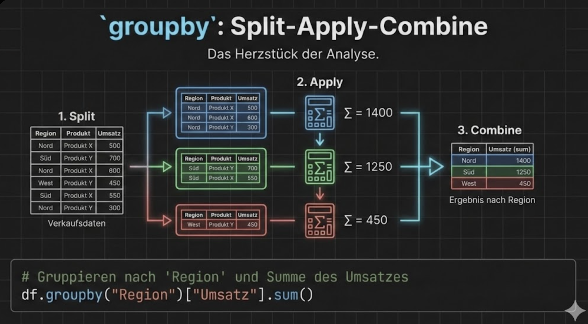

# Pandas Aggregation & Gruppierung

## Übersicht

Aggregation und Gruppierung sind Kernfunktionen für Datenanalyse: Daten zusammenfassen, Muster erkennen und Kennzahlen berechnen.

Das zentrale Prinzip ist **Split-Apply-Combine**:

1. **Split**: Daten nach Spalte(n) gruppieren
2. **Apply**: Funktion auf jede Gruppe anwenden (sum, mean, count, ...)
3. **Combine**: Ergebnisse zu neuem DataFrame zusammenführen

---

## Grundlegende Aggregation

Ohne Gruppierung: Aggregation über den gesamten DataFrame.

```python
import pandas as pd

df = pd.DataFrame({
    'Produkt': ['A', 'B', 'A', 'B', 'A', 'B'],
    'Region': ['Nord', 'Nord', 'Süd', 'Süd', 'Nord', 'Süd'],
    'Umsatz': [100, 150, 200, 120, 180, 90],
    'Menge': [10, 15, 20, 12, 18, 9]
})
```

### Einzelne Aggregationen

```python
print(df['Umsatz'].sum())    # 840
print(df['Umsatz'].mean())   # 140.0
print(df['Umsatz'].median()) # 135.0
print(df['Umsatz'].min())    # 90
print(df['Umsatz'].max())    # 200
print(df['Umsatz'].std())    # 43.82
print(df['Umsatz'].count())  # 6
```

### Mehrere Aggregationen gleichzeitig

```python
print(df['Umsatz'].agg(['sum', 'mean', 'min', 'max']))
# sum     840.0
# mean    140.0
# min      90.0
# max     200.0
```

---

## groupby() – Daten gruppieren

### Grundprinzip: Split-Apply-Combine



### Einfache Gruppierung

```python
# Nach einer Spalte gruppieren
grouped = df.groupby('Produkt')

# Aggregation auf gruppierte Daten
print(df.groupby('Produkt')['Umsatz'].sum())
# Produkt
# A    480
# B    360
# Name: Umsatz, dtype: int64
```

### Mehrere Aggregationen pro Gruppe

```python
print(df.groupby('Produkt')['Umsatz'].agg(['sum', 'mean', 'count']))
#          sum   mean  count
# Produkt                    
# A        480  160.0      3
# B        360  120.0      3
```

### Mehrere Spalten aggregieren

```python
print(df.groupby('Produkt')[['Umsatz', 'Menge']].sum())
#          Umsatz  Menge
# Produkt               
# A           480     48
# B           360     36
```

---

## Gruppierung nach mehreren Spalten

```python
# Multi-Level-Gruppierung
print(df.groupby(['Produkt', 'Region'])['Umsatz'].sum())
# Produkt  Region
# A        Nord      280
#          Süd       200
# B        Nord      150
#          Süd       210
# Name: Umsatz, dtype: int64

# Als DataFrame mit reset_index()
result = df.groupby(['Produkt', 'Region'])['Umsatz'].sum().reset_index()
print(result)
#   Produkt Region  Umsatz
# 0       A   Nord     280
# 1       A    Süd     200
# 2       B   Nord     150
# 3       B    Süd     210
```

---

## agg() – Flexible Aggregation

### Verschiedene Funktionen pro Spalte

```python
# Named Aggregation (empfohlen)
result = df.groupby('Produkt').agg(
    Umsatz_Summe=('Umsatz', 'sum'),
    Umsatz_Schnitt=('Umsatz', 'mean'),
    Menge_Gesamt=('Menge', 'sum'),
    Anzahl=('Umsatz', 'count')
)
print(result)
#          Umsatz_Summe  Umsatz_Schnitt  Menge_Gesamt  Anzahl
# Produkt                                                    
# A                 480           160.0            48       3
# B                 360           120.0            36       3
```

### Dictionary-Syntax

```python
result = df.groupby('Produkt').agg({
    'Umsatz': ['sum', 'mean'],
    'Menge': 'sum'
})
print(result)
#         Umsatz        Menge
#            sum   mean   sum
# Produkt                    
# A          480  160.0    48
# B          360  120.0    36
```

### Eigene Funktionen

```python
# Lambda-Funktion
result = df.groupby('Produkt')['Umsatz'].agg(
    lambda x: x.max() - x.min()  # Spannweite
)
print(result)
# Produkt
# A    100
# B     60

# Benannte eigene Funktion
def spannweite(x):
    return x.max() - x.min()

result = df.groupby('Produkt').agg(
    Spannweite=('Umsatz', spannweite)
)
```

---

## Wichtige Aggregationsfunktionen

| Funktion | Beschreibung |
|----------|--------------|
| `sum()` | Summe |
| `mean()` | Mittelwert |
| `median()` | Median |
| `min()` | Minimum |
| `max()` | Maximum |
| `count()` | Anzahl (ohne NaN) |
| `size()` | Anzahl (mit NaN) |
| `std()` | Standardabweichung |
| `var()` | Varianz |
| `first()` | Erster Wert |
| `last()` | Letzter Wert |
| `nunique()` | Anzahl eindeutiger Werte |

---

## pivot_table() – Kreuztabellen

Pivot-Tabellen strukturieren Daten in einer Matrix-Form.

```python
# Pivot-Tabelle erstellen
pivot = pd.pivot_table(
    df,
    values='Umsatz',      # Welche Werte?
    index='Produkt',      # Zeilen
    columns='Region',     # Spalten
    aggfunc='sum'         # Aggregationsfunktion
)
print(pivot)
# Region   Nord  Süd
# Produkt           
# A         280  200
# B         150  210
```

### Mit mehreren Aggregationen

```python
pivot = pd.pivot_table(
    df,
    values='Umsatz',
    index='Produkt',
    columns='Region',
    aggfunc=['sum', 'mean'],
    margins=True,          # Gesamtsummen hinzufügen
    margins_name='Gesamt'
)
print(pivot)
```

### Mehrere Werte

```python
pivot = pd.pivot_table(
    df,
    values=['Umsatz', 'Menge'],
    index='Produkt',
    columns='Region',
    aggfunc='sum',
    fill_value=0  # NaN durch 0 ersetzen
)
```

---

## crosstab() – Häufigkeitstabellen

Für Häufigkeitsanalysen:

```python
# Anzahl pro Kombination
print(pd.crosstab(df['Produkt'], df['Region']))
# Region   Nord  Süd
# Produkt           
# A           2    1
# B           1    2

# Mit Prozentwerten
print(pd.crosstab(df['Produkt'], df['Region'], normalize='index'))
# Region       Nord       Süd
# Produkt                     
# A        0.666667  0.333333
# B        0.333333  0.666667
```

---

## Praktische Beispiele

### Beispiel 1: Verkaufsanalyse

```python
verkauf = pd.DataFrame({
    'Datum': pd.date_range('2024-01-01', periods=10),
    'Produkt': ['A', 'B', 'A', 'C', 'B', 'A', 'C', 'B', 'A', 'C'],
    'Menge': [5, 3, 8, 2, 6, 4, 7, 9, 3, 5],
    'Preis': [10, 15, 10, 20, 15, 10, 20, 15, 10, 20]
})

# Umsatz berechnen
verkauf['Umsatz'] = verkauf['Menge'] * verkauf['Preis']

# Zusammenfassung pro Produkt
zusammenfassung = verkauf.groupby('Produkt').agg(
    Anzahl_Verkäufe=('Menge', 'count'),
    Gesamtmenge=('Menge', 'sum'),
    Gesamtumsatz=('Umsatz', 'sum'),
    Durchschnittspreis=('Preis', 'mean')
).round(2)

print(zusammenfassung)
```

### Beispiel 2: Zeitbasierte Gruppierung

```python
# Nach Woche gruppieren
verkauf['Woche'] = verkauf['Datum'].dt.isocalendar().week

wochen_umsatz = verkauf.groupby('Woche')['Umsatz'].sum()
print(wochen_umsatz)
```

### Beispiel 3: Top-N pro Gruppe

```python
# Top 2 Umsätze pro Produkt
def top_n(gruppe, n=2):
    return gruppe.nlargest(n, 'Umsatz')

top_2 = verkauf.groupby('Produkt', group_keys=False).apply(top_n, n=2)
print(top_2)
```

---

## transform() – Gruppenwerte zurückschreiben

`transform()` gibt Werte in der **Originalgröße** zurück.

```python
# Durchschnitt pro Gruppe als neue Spalte
df['Umsatz_Durchschnitt_Gruppe'] = df.groupby('Produkt')['Umsatz'].transform('mean')
print(df)
#   Produkt Region  Umsatz  Menge  Umsatz_Durchschnitt_Gruppe
# 0       A   Nord     100     10                       160.0
# 1       B   Nord     150     15                       120.0
# 2       A    Süd     200     20                       160.0
# ...

# Abweichung vom Gruppendurchschnitt
df['Umsatz_Abweichung'] = df['Umsatz'] - df.groupby('Produkt')['Umsatz'].transform('mean')
```

---

## Visualisierung: groupby-Workflow

```kroki-plantuml
@startuml
!theme plain
skinparam backgroundColor transparent

start

:Daten laden;

:groupby('spalte');
note right: Daten nach Spalte\ngruppieren

if (Aggregation?) then (ja)
    :agg(), sum(), mean()...;
    note right: Komprimiert auf\neine Zeile pro Gruppe
else (transform?)
    :transform();
    note right: Behält Original-\nGröße bei
endif

:Ergebnis;

stop
@enduml
```

---

## Gruppen filtern mit filter()

Mit `filter()` kannst du **ganze Gruppen** basierend auf einer Bedingung behalten oder entfernen:

```python
df = pd.DataFrame({
    'Kategorie': ['A', 'A', 'B', 'B', 'B', 'C'],
    'Wert': [10, 20, 30, 40, 50, 60]
})

# Nur Gruppen mit mindestens 2 Einträgen
result = df.groupby('Kategorie').filter(lambda x: len(x) >= 2)
print(result)  # Kategorie C wird entfernt (nur 1 Eintrag)

# Nur Gruppen mit Durchschnitt > 25
result = df.groupby('Kategorie').filter(lambda x: x['Wert'].mean() > 25)
print(result)  # Zeigt A nicht (Durchschnitt 15) 
```

!!! tip "filter() vs. agg()"
    - `agg()` komprimiert Gruppen zu Einzelwerten
    - `filter()` behält oder entfernt ganze Gruppen, ohne zu aggregieren

---

## Zusammenfassung

!!! success "Das Wichtigste"
    - **groupby()**: Daten nach Spalte(n) gruppieren
    - **agg()**: Flexible Aggregation mit mehreren Funktionen
    - **Named Aggregation**: `agg(Name=('Spalte', 'funktion'))`
    - **pivot_table()**: Kreuztabellen mit Zeilen/Spalten
    - **crosstab()**: Häufigkeitstabellen
    - **transform()**: Gruppenwerte in Originalgröße

---

??? question "Selbstkontrolle"
    1. Was ist der Unterschied zwischen `count()` und `size()` bei groupby?
    2. Wie erstellst du eine Aggregation mit verschiedenen Funktionen pro Spalte?
    3. Was macht `transform()` anders als `agg()`?
    4. Wie fügst du Gesamtsummen zu einer Pivot-Tabelle hinzu?
    
    ??? success "Antworten"
        1. `count()` zählt nur Nicht-NaN-Werte, `size()` zählt alle Werte
        2. Mit `agg({'Spalte1': 'sum', 'Spalte2': 'mean'})` oder Named Aggregation
        3. `transform()` gibt Ergebnis in Originalgröße zurück, `agg()` komprimiert
        4. Mit `margins=True` im `pivot_table()`-Aufruf
