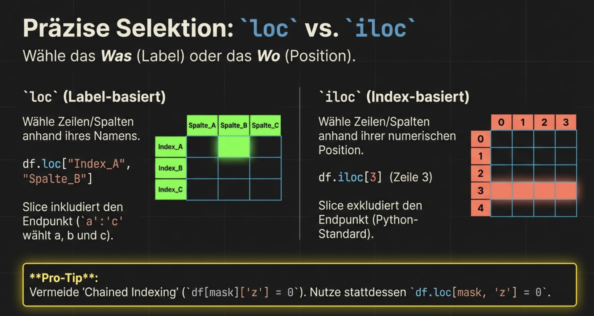
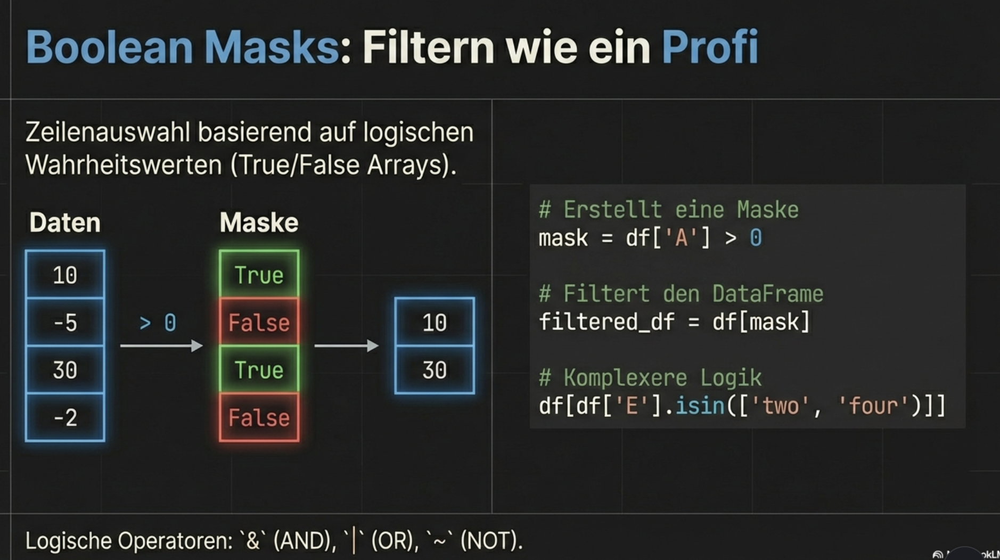

# Pandas Datenzugriff 


## Übersicht der Zugriffsmethoden

Pandas bietet verschiedene Methoden, um auf Daten zuzugreifen:


---

## iloc – Positionsbasierter Zugriff

**iloc** = **i**nteger **loc**ation – Zugriff über **Positionsnummern** (0-basiert)

```python
import pandas as pd

df = pd.DataFrame({
    'Name': ['Max', 'Anna', 'Tom', 'Lisa'],
    'Alter': [25, 30, 28, 22],
    'Stadt': ['Berlin', 'München', 'Hamburg', 'Köln'],
    'Gehalt': [50000, 65000, 55000, 45000]
})
```

### Einzelne Werte

```python
# Zeile 0, Spalte 0
print(df.iloc[0, 0])  # 'Max'

# Zeile 2, Spalte 3
print(df.iloc[2, 3])  # 55000

# Letzte Zeile, letzte Spalte
print(df.iloc[-1, -1])  # 45000
```

### Zeilen auswählen

```python
# Eine Zeile (gibt Series zurück)
print(df.iloc[0])
# Name       Max
# Alter       25
# Stadt   Berlin
# Gehalt   50000

# Mehrere Zeilen (gibt DataFrame zurück)
print(df.iloc[0:3])      # Zeilen 0, 1, 2
print(df.iloc[[0, 2]])   # Zeilen 0 und 2
```

### Spalten auswählen

```python
# Eine Spalte
print(df.iloc[:, 1])  # Spalte 1 (Alter)

# Mehrere Spalten
print(df.iloc[:, 1:3])    # Spalten 1 und 2
print(df.iloc[:, [0, 2]]) # Spalten 0 und 2
```

### Kombiniert: Zeilen UND Spalten

```python
# Zeilen 0-2, Spalten 1-3
print(df.iloc[0:3, 1:4])
#    Alter     Stadt  Gehalt
# 0     25    Berlin   50000
# 1     30   München   65000
# 2     28   Hamburg   55000

# Spezifische Zeilen und Spalten
print(df.iloc[[0, 2], [1, 3]])
#    Alter  Gehalt
# 0     25   50000
# 2     28   55000
```

---

## loc – Label-basierter Zugriff

**loc** verwendet **Labels** (Spaltennamen, Index-Werte)

```python
# Mit Standard-Index (0, 1, 2, ...)
print(df.loc[0, 'Name'])  # 'Max'
print(df.loc[0:2, 'Name':'Stadt'])  # INKLUSIVE 2!

# Spaltenauswahl
print(df.loc[:, 'Alter'])          # Spalte 'Alter'
print(df.loc[:, ['Name', 'Stadt']]) # Mehrere Spalten
```

### Mit benutzerdefiniertem Index

```python
# Index setzen
df_indexed = df.set_index('Name')
print(df_indexed)
#       Alter     Stadt  Gehalt
# Name                          
# Max      25    Berlin   50000
# Anna     30   München   65000
# Tom      28   Hamburg   55000
# Lisa     22      Köln   45000

# Zugriff mit Index-Label
print(df_indexed.loc['Anna'])
# Alter        30
# Stadt   München
# Gehalt    65000

print(df_indexed.loc['Anna', 'Gehalt'])  # 65000
print(df_indexed.loc['Max':'Tom', 'Alter':'Stadt'])
```

!!! warning "Slicing-Unterschied"
    - **iloc**: Stop ist **exklusiv** → `iloc[0:3]` gibt 0, 1, 2
    - **loc**: Stop ist **inklusiv** → `loc[0:3]` gibt 0, 1, 2, 3

---

## Boolean Indexing

Die mächtigste Methode: Auswahl basierend auf **Bedingungen**.



### Grundprinzip

```python
# Schritt 1: Bedingung erstellt Boolean-Series
bedingung = df['Alter'] > 25
print(bedingung)
# 0    False
# 1     True
# 2     True
# 3    False
# dtype: bool

# Schritt 2: Mit Bedingung filtern
print(df[bedingung])
#    Name  Alter     Stadt  Gehalt
# 1  Anna     30   München   65000
# 2   Tom     28   Hamburg   55000

# Kurz: In einer Zeile
print(df[df['Alter'] > 25])
```

### Mehrere Bedingungen

!!! warning "Wichtig: Klammern und Operatoren"
    - Verwende `&` (und), `|` (oder), `~` (nicht)
    - **Nicht** `and`, `or`, `not`
    - Jede Bedingung in Klammern!

```python
# UND-Verknüpfung
print(df[(df['Alter'] > 25) & (df['Gehalt'] > 50000)])
#    Name  Alter     Stadt  Gehalt
# 1  Anna     30   München   65000
# 2   Tom     28   Hamburg   55000

# ODER-Verknüpfung
print(df[(df['Stadt'] == 'Berlin') | (df['Stadt'] == 'München')])

# NICHT
print(df[~(df['Alter'] > 25)])  # Alter <= 25
```

### Mit loc kombinieren

```python
# Filtern UND bestimmte Spalten auswählen
print(df.loc[df['Alter'] > 25, ['Name', 'Gehalt']])
#    Name  Gehalt
# 1  Anna   65000
# 2   Tom   55000
```

---

## query() – Lesbare Filter

Die `query()`-Methode bietet eine lesbarere Alternative zu Boolean Indexing:

```python
# Statt
df[(df['Alter'] > 25) & (df['Gehalt'] > 50000)]

# Mit query()
df.query('Alter > 25 and Gehalt > 50000')

# Mit Variablen
min_alter = 25
df.query('Alter > @min_alter')

# Mit Spaltennamen mit Leerzeichen: Backticks verwenden
df.query('`Spalten Name` > 100')
```

### Vergleich

| Methode | Syntax | Lesbarkeit |
|---------|--------|------------|
| Boolean | `df[(df['A'] > 5) & (df['B'] < 10)]` | Komplex |
| query | `df.query('A > 5 and B < 10')` | Lesbar |

---

## isin() – Mehrere Werte prüfen

```python
# Prüfen ob Wert in Liste
staedte = ['Berlin', 'München']
print(df[df['Stadt'].isin(staedte)])
#    Name  Alter     Stadt  Gehalt
# 0   Max     25    Berlin   50000
# 1  Anna     30   München   65000

# Negation: nicht in Liste
print(df[~df['Stadt'].isin(staedte)])
```

---

## String-Methoden für Filter

Mit `.str` können String-Operationen durchgeführt werden:

```python
# Enthält
print(df[df['Name'].str.contains('a')])  # Namen mit 'a'

# Beginnt mit
print(df[df['Stadt'].str.startswith('B')])

# Endet mit
print(df[df['Name'].str.endswith('a')])

# Länge
print(df[df['Name'].str.len() > 3])

# Case-insensitive
print(df[df['Name'].str.lower().str.contains('max')])
```

---

## Werte ändern

### Einzelne Werte

```python
# Mit loc
df.loc[0, 'Alter'] = 26

# Mit at (schneller)
df.at[0, 'Alter'] = 26
```

### Mehrere Werte mit Bedingung

```python
# Alle Gehälter unter 50000 erhöhen
df.loc[df['Gehalt'] < 50000, 'Gehalt'] = 50000

# Neue Spalte mit Bedingung
df.loc[df['Alter'] >= 30, 'Kategorie'] = 'Senior'
df.loc[df['Alter'] < 30, 'Kategorie'] = 'Junior'
```

!!! danger "SettingWithCopyWarning"
    Vermeide verkettete Zuweisungen:
    ```python
    # FALSCH - kann Warning erzeugen
    df[df['Alter'] > 25]['Gehalt'] = 70000
    
    # RICHTIG - mit loc
    df.loc[df['Alter'] > 25, 'Gehalt'] = 70000
    ```

---

## Praktische Beispiele

### Beispiel 1: Top-Verdiener finden

```python
# Top 3 Gehälter
top3 = df.nlargest(3, 'Gehalt')
print(top3[['Name', 'Gehalt']])

# Alternative mit Sortierung
top3 = df.sort_values('Gehalt', ascending=False).head(3)
```

### Beispiel 2: Daten filtern und transformieren

```python
# Mitarbeiter aus Berlin mit Gehalt > 45000
berlin_gut = df.loc[
    (df['Stadt'] == 'Berlin') & (df['Gehalt'] > 45000),
    ['Name', 'Gehalt']
]
print(berlin_gut)
```

### Beispiel 3: Bedingte Spalte erstellen

```python
# Gehaltskategorie
df['Gehaltsstufe'] = 'Niedrig'
df.loc[df['Gehalt'] >= 50000, 'Gehaltsstufe'] = 'Mittel'
df.loc[df['Gehalt'] >= 60000, 'Gehaltsstufe'] = 'Hoch'
```

---

## Zusammenfassung

!!! success "Das Wichtigste"
    - **iloc**: Positionsbasiert (Integer), Stop exklusiv
    - **loc**: Labelbasiert (Namen), Stop inklusiv
    - **Boolean Indexing**: `df[df['spalte'] > wert]`
    - **Mehrere Bedingungen**: `&` (und), `|` (oder), `~` (nicht) + Klammern
    - **query()**: Lesbare Alternative für Filter
    - **Werte ändern**: Immer mit `loc` oder `at`, nie verkettet

---

??? question "Selbstkontrolle"
    1. Was ist der Unterschied zwischen `df.iloc[0:3]` und `df.loc[0:3]`?
    2. Wie filterst du alle Zeilen, wo `Alter` zwischen 25 und 30 liegt?
    3. Warum sollte man `&` statt `and` bei Pandas-Bedingungen verwenden?
    4. Wie vermeidest du `SettingWithCopyWarning`?
    
    ??? success "Antworten"
        1. `iloc` gibt 3 Zeilen (0,1,2), `loc` gibt 4 Zeilen (0,1,2,3) weil Stop inklusiv
        2. `df[(df['Alter'] >= 25) & (df['Alter'] <= 30)]` oder `df.query('25 <= Alter <= 30')`
        3. `&` ist element-wise für Series, `and` funktioniert nicht mit Series
        4. Verwende `df.loc[bedingung, 'spalte'] = wert` statt `df[bedingung]['spalte'] = wert`
