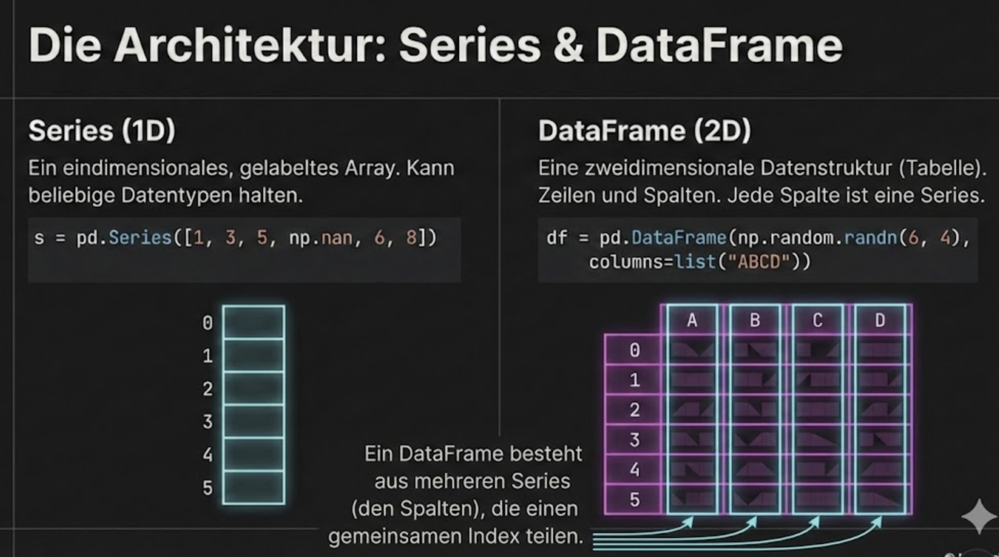

# Pandas Grundlagen

## Was ist Pandas?

**Pandas** ist die wichtigste Python-Bibliothek für Datenanalyse. Sie bietet leistungsstarke, flexible Datenstrukturen für die Arbeit mit tabellarischen Daten.



---

## Installation

```bash
pip install pandas
```

Import-Konvention:
```python
import pandas as pd
```

---

## Series – 1D-Datenstruktur

Eine **Series** ist wie eine Spalte in einer Tabelle: eine eindimensionale Datenstruktur mit Index.

```python
import pandas as pd

# Series aus Liste
umsatz = pd.Series([1200, 1500, 1800, 1400])
print(umsatz)
# 0    1200
# 1    1500
# 2    1800
# 3    1400
# dtype: int64
```

### Mit benutzerdefiniertem Index

```python
umsatz = pd.Series([1200, 1500, 1800, 1400], 
                   index=['Jan', 'Feb', 'Mär', 'Apr'])
print(umsatz)
# Jan    1200
# Feb    1500
# Mär    1800
# Apr    1400
# dtype: int64

# Zugriff
print(umsatz['Feb'])     # 1500
print(umsatz[1])         # 1500 (auch mit Position)
print(umsatz['Jan':'Mär'])  # Slicing mit Labels (inklusiv!)
```

---

## DataFrame – 2D-Datenstruktur

Ein **DataFrame** ist wie eine Tabelle: Zeilen und Spalten mit Labels.

### DataFrame erstellen

```python
# Aus Dictionary
daten = {
    'Name': ['Max', 'Anna', 'Tom'],
    'Alter': [25, 30, 28],
    'Stadt': ['Berlin', 'München', 'Hamburg']
}
df = pd.DataFrame(daten)
print(df)
#    Name  Alter     Stadt
# 0   Max     25    Berlin
# 1  Anna     30   München
# 2   Tom     28   Hamburg
```

### Aus Liste von Dictionaries

```python
personen = [
    {'Name': 'Max', 'Alter': 25},
    {'Name': 'Anna', 'Alter': 30},
    {'Name': 'Tom', 'Alter': 28}
]
df = pd.DataFrame(personen)
```

---

## Daten laden – CSV

Die häufigste Art, Daten zu laden:

```python
# CSV laden
df = pd.read_csv('datei.csv')

# Mit Optionen
df = pd.read_csv('datei.csv',
                 sep=';',           # Trennzeichen
                 encoding='utf-8',  # Zeichenkodierung
                 index_col=0,       # Spalte als Index
                 parse_dates=['Datum'],  # Datum parsen
                 na_values=['NA', 'n/a'])  # Fehlende Werte
```

### Weitere Lademethoden

| Funktion | Format |
|----------|--------|
| `pd.read_csv()` | CSV |
| `pd.read_excel()` | Excel |
| `pd.read_json()` | JSON |
| `pd.read_sql()` | SQL-Datenbank |
| `pd.read_html()` | HTML-Tabellen |

---

## Daten inspizieren

### Erste Übersicht

```python
df = pd.read_csv('daten.csv')

# Erste/letzte Zeilen
print(df.head())      # Erste 5 Zeilen
print(df.head(10))    # Erste 10 Zeilen
print(df.tail(3))     # Letzte 3 Zeilen

# Dimensionen
print(df.shape)       # (Zeilen, Spalten)

# Spalteninformationen
print(df.columns)     # Spaltennamen
print(df.dtypes)      # Datentypen pro Spalte

# Kompakte Info
print(df.info())
```

**Beispiel `df.info()` Ausgabe:**
```
<class 'pandas.core.frame.DataFrame'>
RangeIndex: 1000 entries, 0 to 999
Data columns (total 5 columns):
 #   Column  Non-Null Count  Dtype  
---  ------  --------------  -----  
 0   Name    1000 non-null   object 
 1   Alter   998 non-null    float64
 2   Stadt   1000 non-null   object 
 3   Gehalt  1000 non-null   int64  
 4   Datum   1000 non-null   object 
dtypes: float64(1), int64(1), object(3)
memory usage: 39.2+ KB
```

### Statistische Zusammenfassung

```python
# Numerische Spalten
print(df.describe())
#              Alter        Gehalt
# count  998.000000   1000.000000
# mean    32.450000   52340.000000
# std      8.234000   15230.000000
# min     18.000000   25000.000000
# 25%     26.000000   42000.000000
# 50%     31.000000   51000.000000
# 75%     38.000000   62000.000000
# max     65.000000   95000.000000

# Alle Spalten (inkl. Text)
print(df.describe(include='all'))
```

---

## Spalten auswählen

```python
# Eine Spalte (gibt Series zurück)
namen = df['Name']
print(type(namen))  # <class 'pandas.core.series.Series'>

# Mehrere Spalten (gibt DataFrame zurück)
auswahl = df[['Name', 'Alter']]
print(type(auswahl))  # <class 'pandas.core.frame.DataFrame'>

# Mit Punkt-Notation (nur bei einfachen Spaltennamen)
alter = df.Alter
```

!!! warning "Punkt-Notation"
    Funktioniert nur, wenn der Spaltenname:
    - Keine Leerzeichen enthält
    - Nicht mit einer Zahl beginnt
    - Nicht mit einer DataFrame-Methode kollidiert

---

## Neue Spalten erstellen

```python
# Berechnung
df['Gehalt_Monat'] = df['Gehalt'] / 12

# Aus bestehenden Spalten
df['Name_Stadt'] = df['Name'] + ' aus ' + df['Stadt']

# Mit Bedingung
df['Senior'] = df['Alter'] >= 30
```

---

## Spalten umbenennen

```python
# Einzelne Spalten
df = df.rename(columns={'Name': 'Vorname', 'Alter': 'Jahre'})

# Alle Spalten
df.columns = ['spalte1', 'spalte2', 'spalte3']

# Alle Spaltennamen zu Kleinbuchstaben
df.columns = df.columns.str.lower()
```

---

## Datentypen konvertieren

```python
# Datentyp einer Spalte prüfen
print(df['Alter'].dtype)  # float64

# Konvertieren
df['Alter'] = df['Alter'].astype(int)
df['Datum'] = pd.to_datetime(df['Datum'])
df['Kategorie'] = df['Kategorie'].astype('category')
```

### Wichtige Datentypen

| Pandas Dtype | Beschreibung |
|--------------|--------------|
| `int64` | Ganzzahlen |
| `float64` | Fließkommazahlen |
| `object` | Strings (Text) |
| `bool` | Wahrheitswerte |
| `datetime64` | Datum/Zeit |
| `category` | Kategorien (speichereffizient) |

---

## Daten speichern

```python
# Als CSV
df.to_csv('ausgabe.csv', index=False)  # ohne Index-Spalte

# Als Excel
df.to_excel('ausgabe.xlsx', sheet_name='Daten')

# Als JSON
df.to_json('ausgabe.json', orient='records')
```

---

## Praxisbeispiel: Erste Datenanalyse

```python
import pandas as pd

# Daten laden
df = pd.read_csv('verkaufsdaten.csv')

# Überblick
print(f"Datensatz: {df.shape[0]} Zeilen, {df.shape[1]} Spalten")
print(f"\nSpalten: {list(df.columns)}")

# Datentypen prüfen
print(f"\nDatentypen:")
print(df.dtypes)

# Fehlende Werte?
print(f"\nFehlende Werte pro Spalte:")
print(df.isna().sum())

# Numerische Statistik
print(f"\nStatistik:")
print(df.describe())

# Erste Zeilen ansehen
print(f"\nErste 5 Zeilen:")
print(df.head())
```

---


## Zusammenfassung

!!! success "Das Wichtigste"
    - **Series**: 1D-Datenstruktur (wie eine Spalte)
    - **DataFrame**: 2D-Datenstruktur (wie eine Tabelle)
    - **Laden**: `pd.read_csv()`, `pd.read_excel()` etc.
    - **Inspizieren**: `head()`, `info()`, `describe()`, `shape`
    - **Spalten**: `df['spalte']` für eine, `df[['a', 'b']]` für mehrere
    - **Speichern**: `to_csv()`, `to_excel()` etc.

---

??? question "Selbstkontrolle"
    1. Was ist der Unterschied zwischen Series und DataFrame?
    2. Wie lädst du eine CSV-Datei mit Semikolon als Trennzeichen?
    3. Was gibt `df.shape` zurück?
    4. Wie erstellst du eine neue Spalte `Bonus`, die 10% des `Gehalts` ist?
    
    ??? success "Antworten"
        1. Series ist 1D (eine Spalte), DataFrame ist 2D (Tabelle mit mehreren Spalten)
        2. `pd.read_csv('datei.csv', sep=';')`
        3. Ein Tupel `(Anzahl_Zeilen, Anzahl_Spalten)`
        4. `df['Bonus'] = df['Gehalt'] * 0.10`
