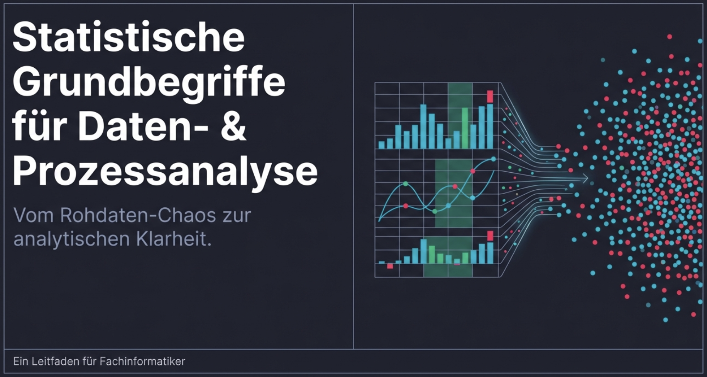
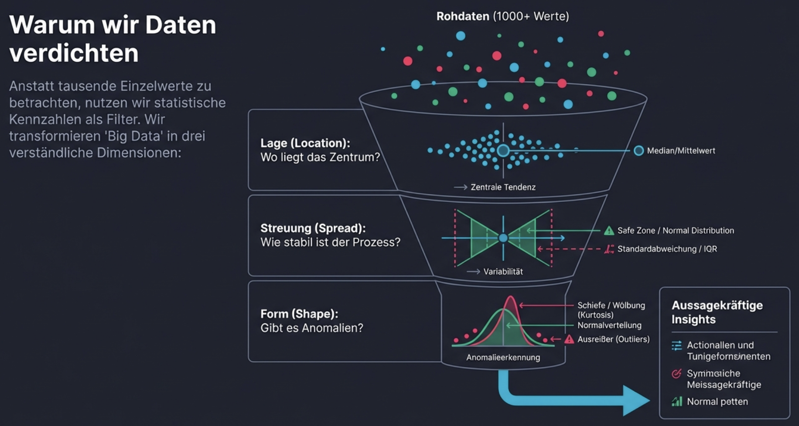
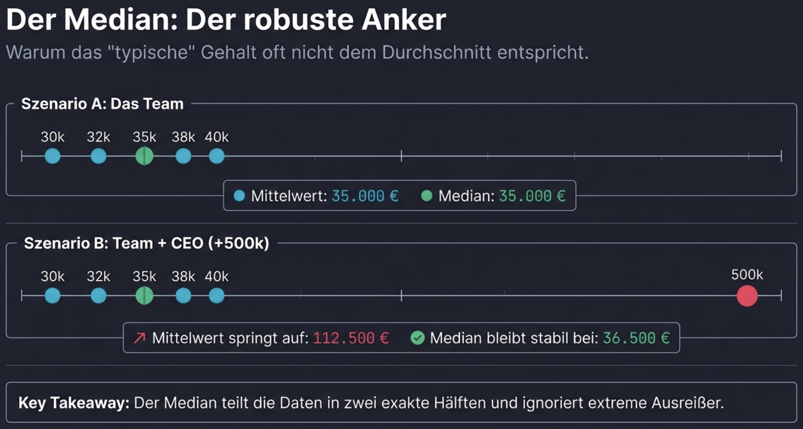
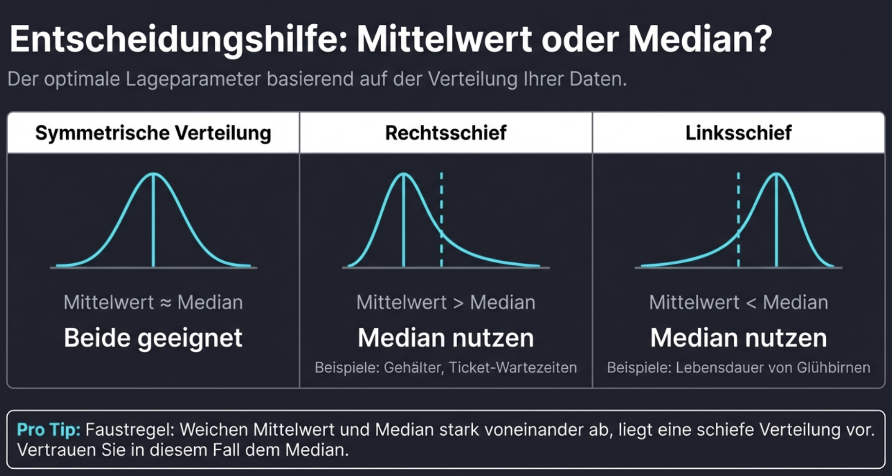
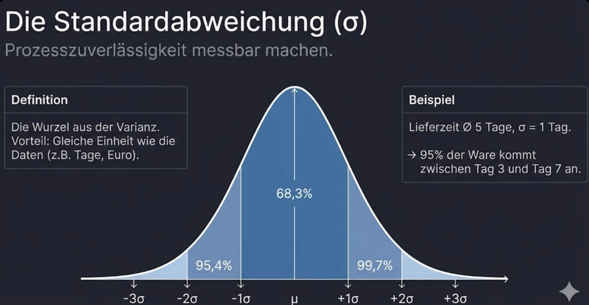
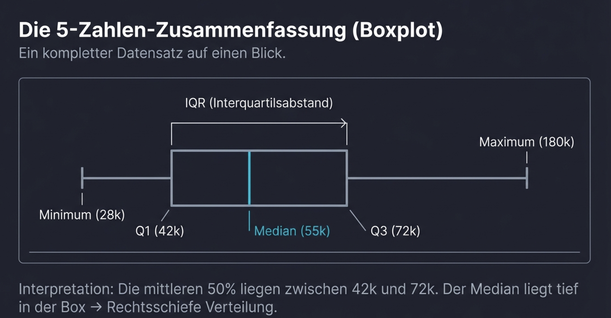

# Statistische Grundbegriffe






---

## Lagemaße – Wo liegt das Zentrum?

Lagemaße beschreiben, wo sich die "Mitte" der Daten befindet.

### Mittelwert (arithmetisches Mittel)

**Was ist das?**  
Die Summe aller Werte geteilt durch ihre Anzahl.

$$\bar{x} = \frac{1}{n}\sum_{i=1}^{n} x_i$$

**Wann benutzen?**

- Bei **symmetrisch verteilten** Daten ohne extreme Ausreißer
- Wenn alle Werte gleich wichtig sind
- Für Berechnungen, die weiterverwendet werden (z.B. Varianz)

**Vorsicht!**  
Der Mittelwert ist **anfällig für Ausreißer**:

| Gehälter | 30k, 32k, 35k, 38k, 40k |
|----------|-------------------------|
| Mittelwert | 35.000 € |
| + CEO-Gehalt 500k | 30k, 32k, 35k, 38k, 40k, 500k |
| Neuer Mittelwert | **112.500 €** |

→ Ein einzelner Extremwert verzerrt das Bild komplett!

**Praxisbeispiel:**  
*"Die durchschnittliche Wartezeit in der Notaufnahme beträgt 45 Minuten."*  
→ Nützlich für Kapazitätsplanung, aber einzelne lange Wartezeiten (Ausreißer) können den Wert stark beeinflussen.

---

### Median

**Was ist das?**  
Der Wert, der die sortierte Datenreihe in zwei gleich große Hälften teilt. 50% der Werte liegen darunter, 50% darüber.

**Wann benutzen?**

- Bei **schiefen Verteilungen** (z.B. Einkommen, Immobilienpreise)
- Wenn **Ausreißer** vorhanden sind
- Für "typische" Werte in einer Verteilung



**Praxisbeispiel:**  
*"Der Median-Immobilienpreis in München liegt bei 750.000 €."*  
→ Aussagekräftiger als der Mittelwert, da Luxusimmobilien den Durchschnitt stark nach oben ziehen würden.



---

### Modus

**Was ist das?**  
Der häufigste Wert in einer Datenreihe.

**Wann benutzen?**

- Bei **kategorialen Daten** (z.B. beliebteste Farbe, häufigste Schuhgröße)
- Um den "typischsten" Wert zu finden
- Bei **Mehrfachgipfeln** (bimodale Verteilungen)

**Praxisbeispiel:**  
*"Die am häufigsten verkaufte T-Shirt-Größe ist M."*  
→ Wichtig für Lagerbestellung und Produktion.

---

### Mittelwert vs. Median – Wann welchen?

| Verteilung | Beziehung | Empfehlung |
|------------|-----------|------------|
| Symmetrisch | Mittelwert ≈ Median | Beide geeignet |
| Rechtsschief (wenige hohe Werte) | Mittelwert > Median | Median bevorzugen |
| Linksschief (wenige niedrige Werte) | Mittelwert < Median | Median bevorzugen |

| Situation | Empfehlung |
|-----------|------------|
| Normalverteilte Daten (Körpergröße, IQ) | Mittelwert |
| Einkommen, Vermögen | Median |
| Immobilienpreise | Median |
| Prüfungsnoten (ohne Ausreißer) | Mittelwert |
| Wartezeiten | Median |

!!! tip "Faustregel"
    Wenn Mittelwert und Median stark voneinander abweichen, liegt eine **schiefe Verteilung** vor. In diesem Fall ist der **Median** meist aussagekräftiger.

---

## Streuungsmaße – Wie breit verteilt?

Streuungsmaße beschreiben, wie stark die Werte um das Zentrum schwanken.

### Spannweite (Range)

**Was ist das?**  
Die Differenz zwischen Maximum und Minimum.

$$\text{Spannweite} = x_{max} - x_{min}$$

**Wann benutzen?**

- Schneller Überblick über den Wertebereich
- Qualitätskontrolle (Toleranzgrenzen)

**Schwäche:**  
Nur zwei Werte bestimmen die Spannweite → extrem anfällig für Ausreißer.

**Praxisbeispiel:**  
*"Die Temperaturen schwankten heute zwischen 12°C und 24°C."*  
→ Spannweite = 12°C

---

### Varianz

**Was ist das?**  
Der Durchschnitt der quadrierten Abweichungen vom Mittelwert.

$$\sigma^2 = \frac{1}{n}\sum_{i=1}^{n}(x_i - \bar{x})^2$$

**Warum Quadrieren?**

1. Positive und negative Abweichungen heben sich sonst auf
2. Große Abweichungen werden stärker gewichtet

**Problem:**  
Die Einheit ist quadriert (z.B. €² oder cm²) → schwer zu interpretieren.

**Wann benutzen?**

- Für mathematische Berechnungen
- Als Zwischenschritt zur Standardabweichung
- In statistischen Tests

---

### Standardabweichung

**Was ist das?**  
Die Quadratwurzel der Varianz – gibt die durchschnittliche Abweichung vom Mittelwert an.

$$\sigma = \sqrt{\frac{1}{n}\sum_{i=1}^{n}(x_i - \bar{x})^2}$$



---

### Variationskoeffizient (CV)

**Was ist das?**  
Die Standardabweichung relativ zum Mittelwert (in Prozent).

$$CV = \frac{\sigma}{\bar{x}} \times 100\%$$

**Warum benutzen?**

- **Vergleich** von Streuungen bei unterschiedlichen Skalen
- Unabhängig von der Maßeinheit

**Praxisbeispiel:**

| Tier | Mittleres Gewicht | Standardabw. | CV |
|------|-------------------|--------------|-----|
| Maus | 30 g | 5 g | 16,7% |
| Elefant | 5.000 kg | 500 kg | 10% |

→ Obwohl Elefanten absolut 100.000× mehr streuen, ist die **relative Streuung** bei Mäusen größer!

---

## Perzentile und Quartile

### Was sind Perzentile?

Das p-te Perzentil ist der Wert, unter dem p% der Daten liegen.

| Perzentil | Bedeutung |
|-----------|-----------|
| 25. Perzentil (Q1) | 25% der Werte liegen darunter |
| 50. Perzentil (Q2) | 50% darunter = **Median** |
| 75. Perzentil (Q3) | 75% der Werte liegen darunter |
| 90. Perzentil | Nur 10% sind größer |

**Wann benutzen?**

- Für **robuste Beschreibungen** (weniger anfällig für Ausreißer als Mittelwert/Standardabweichung)
- Um **Verteilungen** zu charakterisieren
- Bei **Leistungsvergleichen** (z.B. "Sie gehören zu den besten 10%")

**Praxisbeispiel:**  
*"Das 90. Perzentil der Ladezeiten beträgt 3 Sekunden."*  
→ 90% der Nutzer erleben Ladezeiten unter 3 Sekunden.  
→ Wichtiger als der Durchschnitt für die Nutzererfahrung!

---

### Interquartilsabstand (IQR)

**Was ist das?**  
Die Differenz zwischen dem 75. und 25. Perzentil.

$$IQR = Q3 - Q1$$

**Warum wichtig?**

- Beschreibt die **mittleren 50%** der Daten
- **Robust** gegen Ausreißer
- Basis für **Boxplots** und **Ausreißererkennung**

```kroki-plantuml
@startuml
!theme plain
skinparam backgroundColor transparent

rectangle "Datenverteilung" as data #lightgray {
    rectangle "25%" as low #lightblue
    rectangle "IQR\n(mittlere 50%)" as iqr #lightgreen
    rectangle "25%" as high #lightblue
}

low -right-> iqr : Q1
iqr -right-> high : Q3
@enduml
```

---

### Die 5-Zahlen-Zusammenfassung

Eine kompakte Beschreibung jeder Verteilung:

| Kennzahl | Bedeutung |
|----------|-----------|
| Minimum | Kleinster Wert |
| Q1 (25%) | Unteres Quartil |
| Median (50%) | Mittlerer Wert |
| Q3 (75%) | Oberes Quartil |
| Maximum | Größter Wert |



**Praxisbeispiel – Gehälter in einer Firma:**

| Kennzahl | Wert |
|----------|------|
| Minimum | 28.000 € |
| Q1 | 42.000 € |
| Median | 55.000 € |
| Q3 | 72.000 € |
| Maximum | 180.000 € |

→ Die mittleren 50% verdienen zwischen 42k und 72k €.  
→ Der Median (55k) liegt deutlich unter dem vermuteten Mittelwert → rechtsschiefe Verteilung.

---

## Ausreißer erkennen

### Was sind Ausreißer?

Werte, die **ungewöhnlich weit** vom Rest der Daten entfernt liegen.

### IQR-Methode (Tukey's Fences)

Ein Wert ist ein Ausreißer, wenn er außerhalb dieser Grenzen liegt:

- **Untere Grenze:** Q1 - 1,5 × IQR
- **Obere Grenze:** Q3 + 1,5 × IQR

```kroki-plantuml
@startuml
!theme plain
skinparam backgroundColor transparent

rectangle "               Keine Ausreißer                " as normal #lightgreen

rectangle "Ausreißer" as low #lightyellow
rectangle "Ausreißer" as high #lightyellow

low -right-> normal : "Q1 - 1,5×IQR"
normal -right-> high : "Q3 + 1,5×IQR"
@enduml
```

**Praxisbeispiel:**

Fahrpreise: Q1 = 8€, Q3 = 25€  
→ IQR = 17€  
→ Untere Grenze: 8 - 1,5×17 = -17,5€ (effektiv 0€)  
→ Obere Grenze: 25 + 1,5×17 = 50,5€  
→ Fahrten über 50,50€ sind potenzielle Ausreißer.

### Umgang mit Ausreißern

| Strategie | Wann geeignet |
|-----------|---------------|
| Behalten | Wenn sie echte, wichtige Datenpunkte sind |
| Entfernen | Bei Messfehlern oder Dateneingabefehlern |
| Transformieren | Bei schiefen Verteilungen (z.B. log-Transformation) |
| Robuste Methoden | Median statt Mittelwert verwenden |

!!! warning "Wichtig"
    Ausreißer sind nicht automatisch "falsch"! Ein Taxi-Fahrpreis von 200€ kann eine echte Flughafenfahrt sein. Immer den **Kontext** prüfen!

---

## Zusammenhänge zwischen Variablen

### Korrelation

**Was ist das?**  
Ein Maß für den **linearen Zusammenhang** zwischen zwei Variablen (-1 bis +1).

| Wert | Bedeutung |
|------|-----------|
| +1 | Perfekter positiver Zusammenhang |
| 0 | Kein linearer Zusammenhang |
| -1 | Perfekter negativer Zusammenhang |

| Korrelation | Bedeutung | Beispiel |
|-------------|-----------|----------|
| r ≈ +0,9 (stark positiv) | Je mehr A, desto mehr B | Lernzeit → bessere Note |
| r ≈ 0 (kein Zusammenhang) | A und B unabhängig | Schuhgröße → IQ |
| r ≈ -0,8 (stark negativ) | Je mehr A, desto weniger B | Fehlstunden → schlechtere Note |

!!! danger "Korrelation ≠ Kausalität"
    Ein Zusammenhang bedeutet **nicht**, dass eine Variable die andere **verursacht**!
    
    Beispiel: Eisverkauf und Sonnenbrand korrelieren stark positiv.  
    → Aber Eis essen verursacht keinen Sonnenbrand!  
    → Beide werden durch einen dritten Faktor (Sonnenschein) beeinflusst.

---

## Praktische Checkliste

Wenn du einen neuen Datensatz analysierst:

- [ ] **Lagemaße berechnen:** Mittelwert und Median → Sind sie ähnlich?
- [ ] **Streuung prüfen:** Standardabweichung und IQR
- [ ] **Extremwerte identifizieren:** Minimum, Maximum, Spannweite
- [ ] **Verteilung verstehen:** 5-Zahlen-Zusammenfassung
- [ ] **Ausreißer erkennen:** IQR-Methode anwenden
- [ ] **Zusammenhänge suchen:** Korrelationen zwischen Variablen

---

## Zusammenfassung

!!! success "Das Wichtigste"
    
    **Lagemaße (Zentrum):**
    
    - **Mittelwert:** Durchschnitt – bei symmetrischen Daten
    - **Median:** Mittlerer Wert – robust gegen Ausreißer
    - **Modus:** Häufigster Wert – für kategoriale Daten
    
    **Streuungsmaße (Breite):**
    
    - **Standardabweichung:** Durchschnittliche Abweichung vom Mittelwert
    - **Varianz:** Quadrierte Standardabweichung
    - **IQR:** Robustes Maß für die mittleren 50%
    
    **Perzentile:**
    
    - Q1 (25%), Median (50%), Q3 (75%)
    - 5-Zahlen-Zusammenfassung für schnellen Überblick
    
    **Goldene Regel:**
    
    Wenn Mittelwert ≠ Median → schiefe Verteilung → **Median bevorzugen**

---

??? question "Selbstkontrolle"
    1. Warum ist der Median oft besser geeignet als der Mittelwert für Gehaltsdaten?
    2. Was sagt eine hohe Standardabweichung über die Daten aus?
    3. Das 90. Perzentil einer Prüfung liegt bei 85 Punkten. Was bedeutet das?
    4. Q1 = 20, Q3 = 50. Ab welchem Wert ist ein Datenpunkt ein Ausreißer (nach oben)?
    5. Die Korrelation zwischen zwei Variablen beträgt r = 0,95. Bedeutet das, dass A die Ursache für B ist?
    
    ??? success "Antworten"
        1. Weil Gehälter meist rechtsschief verteilt sind (wenige sehr hohe Gehälter ziehen den Mittelwert nach oben). Der Median zeigt das "typische" Gehalt besser.
        2. Die Werte sind weit um den Mittelwert gestreut – es gibt große Unterschiede zwischen den einzelnen Datenpunkten.
        3. 90% der Teilnehmer haben 85 Punkte oder weniger erreicht. Nur 10% waren besser.
        4. IQR = 30. Obere Grenze = Q3 + 1,5×IQR = 50 + 45 = **95**. Werte über 95 sind Ausreißer.
        5. **Nein!** Korrelation zeigt nur einen Zusammenhang, keine Kausalität. Es könnte auch ein dritter Faktor beide Variablen beeinflussen.
